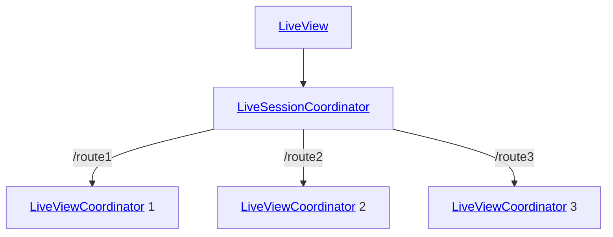

# High-Level Overview

## [`LiveView`](https://github.com/liveview-native/liveview-client-swiftui/blob/main/Sources/LiveViewNative/LiveView.swift)
The `LiveView` struct is a SwiftUI View that connects to a Phoenix LiveView application. This View can be included anywhere in a SwiftUI View hierarchy.

## [`LiveSessionCoordinator`](https://github.com/liveview-native/liveview-client-swiftui/blob/main/Sources/LiveViewNative/Coordinators/LiveSessionCoordinator.swift)
Each `LiveView` is controlled by a `LiveSessionCoordinator`. The session coordinator is responsible for handling the WebSocket connection.

There is only one WebSocket open during lifetime of the `LiveView`.

## [`LiveViewCoordinator`](https://github.com/liveview-native/liveview-client-swiftui/blob/main/Sources/LiveViewNative/Coordinators/LiveViewCoordinator.swift)
A `LiveView` SwiftUI View handles navigation internally. By using `push_event`, `push_patch`, or `redirect`, and Phoenix LiveView can change the top-most route in the navigation stack.

Each entry in this navigation stack is controlled by a `LiveViewCoordinator`. This coordinator is responsible for a single Phoenix Channel, which communicates over the shared socket.

This separation exists so that multiple channels can be opened on the same socket. This allows for a sidebar/content/detail split where each split renders a different Phoenix LiveView.

## [`NavStackEntryView`](https://github.com/liveview-native/liveview-client-swiftui/blob/main/Sources/LiveViewNative/NavStackEntryView.swift)
This View is controlled by the `LiveViewCoordinator` for a given navigation path.

It is the View that contains the content of the document as a SwiftUI View hierarchy.