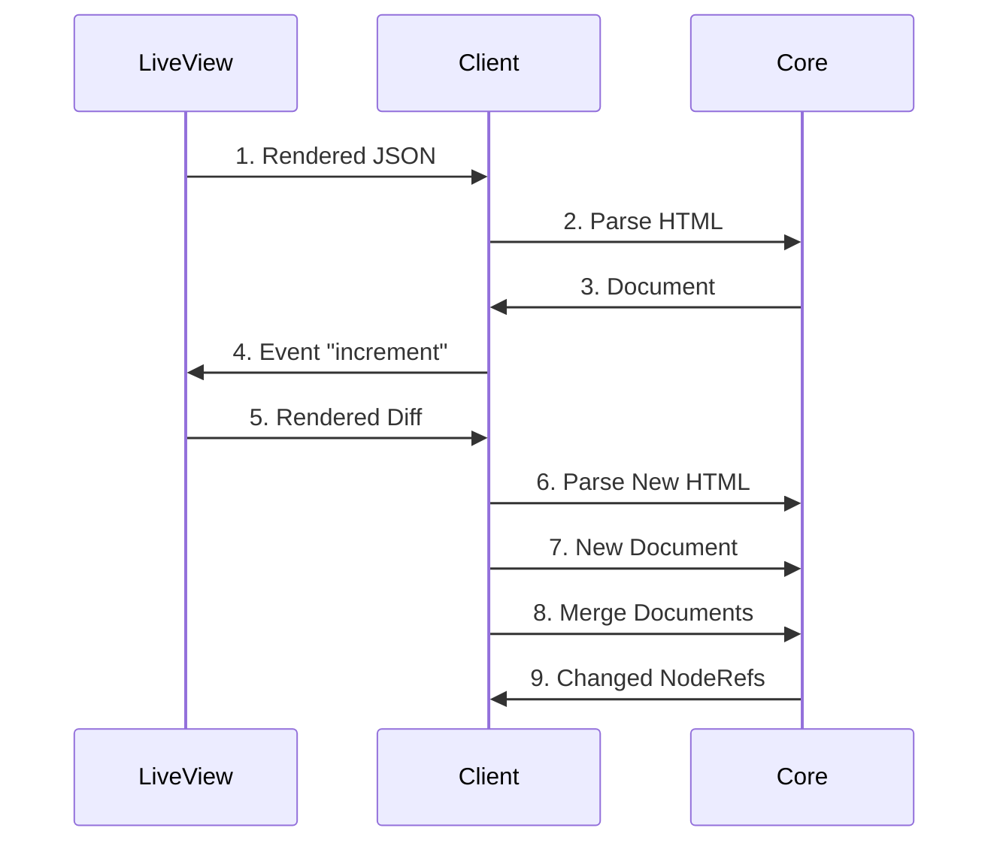
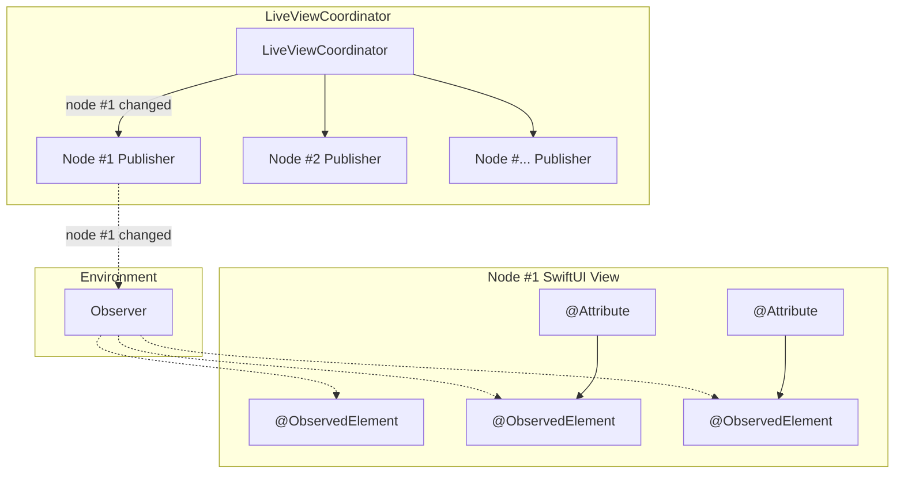

# Updates
Whenever the template changes, a [`diff` event](https://github.com/liveview-native/liveview-client-swiftui/blob/9895c3b16d84a2683dcb1f127994be6c1bdf4919/Sources/LiveViewNative/Coordinators/LiveViewCoordinator.swift#L250-L257) is sent to the client. `liveview-native-core` handles most of this process.

## Update Process
1. When the page loads, Phoenix sends a JSON representation of the [`Phoenix.LiveView.Rendered` struct](https://hexdocs.pm/phoenix_live_view/Phoenix.LiveView.Engine.html#module-phoenix-liveview-rendered)
2. [The client parses this data](https://github.com/liveview-native/liveview-client-swiftui/blob/0e0fc6bbe5e95ef308e51551af0889acb09b87b3/Sources/LiveViewNative/Coordinators/LiveViewCoordinator.swift#L380), and forms a complete HTML document. It passes this HTML string to core to be parsed.
3. Core [sends back a `Document`](https://github.com/liveview-native/liveview-client-swiftui/blob/0e0fc6bbe5e95ef308e51551af0889acb09b87b3/Sources/LiveViewNative/Coordinators/LiveViewCoordinator.swift#L381) with parsed nodes and elements, which the client renders to native elements
4. The client sends an event in response to some user interaction
5. The LiveView computes the changes, and sends a fragment diff to the client.
6. The client [merges this fragment diff](https://github.com/liveview-native/liveview-client-swiftui/blob/0e0fc6bbe5e95ef308e51551af0889acb09b87b3/Sources/LiveViewNative/Coordinators/LiveViewCoordinator.swift#L192) with the previous `Rendered` struct, and sends the complete HTML to core to parse.
7. Core returns a parsed document.
8. The client asks core to [merge the new document](https://github.com/liveview-native/liveview-client-swiftui/blob/0e0fc6bbe5e95ef308e51551af0889acb09b87b3/Sources/LiveViewNative/Coordinators/LiveViewCoordinator.swift#L193) into the old document so they match.
9. Core [sends the ID of any changed nodes](https://github.com/liveview-native/liveview-client-swiftui/blob/9895c3b16d84a2683dcb1f127994be6c1bdf4919/Sources/LiveViewNative/Coordinators/LiveViewCoordinator.swift#L390-L406) to the client to update.

## Update Isolation
To keep updates fast, individual Views are updated based on the elements that change between a diff.

The `LiveViewCoordinator` stores [a dictionary that maps a `NodeRef` to a Combine publisher](https://github.com/liveview-native/liveview-client-swiftui/blob/9895c3b16d84a2683dcb1f127994be6c1bdf4919/Sources/LiveViewNative/Coordinators/LiveViewCoordinator.swift#L41).

Whenever [core sends an update event](https://github.com/liveview-native/liveview-client-swiftui/blob/9895c3b16d84a2683dcb1f127994be6c1bdf4919/Sources/LiveViewNative/Coordinators/LiveViewCoordinator.swift#L390-L406) for this `NodeRef`, a signal is sent through the corresponding publisher to all of its subscribers.

### `@ObservedElement`
The `ObservedElement` property wrapper watches for changes to the node, and triggers a View update when change events are received.

This is done through the `Observer` class. [It subscribes to the Combine publisher for the matching `NodeRef`](https://github.com/liveview-native/liveview-client-swiftui/blob/9895c3b16d84a2683dcb1f127994be6c1bdf4919/Sources/LiveViewNative/Property%20Wrappers/ObservedElement.swift#L120-L123).

[One `Observer` instance is created](https://github.com/liveview-native/liveview-client-swiftui/blob/9895c3b16d84a2683dcb1f127994be6c1bdf4919/Sources/LiveViewNative/ViewTree.swift#L52) for each View to avoid redundant subscriptions in the case of multiple `ObservedElement` wrappers (common when using `@Attribute`).

