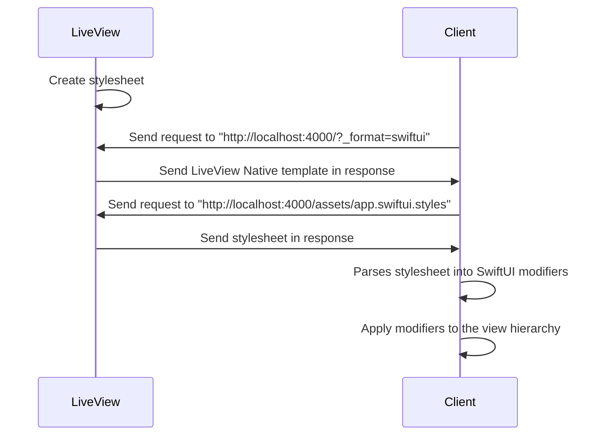
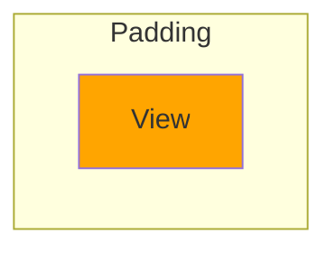
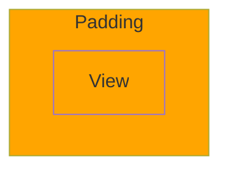

# Stylesheets

[](https://livebook.dev/run?url=https%3A%2F%2Fgithub.com%2Fliveview-native%2Fliveview-client-swiftui%2Fblob%2Fmain%2Flivebooks%2Fstylesheets.livemd)

## Overview

In this guide, you'll learn how to use stylesheets to customize the appearance of your LiveView Native Views. You'll also learn about the inner workings of how LiveView Native uses stylesheets to implement modifiers, and how those modifiers style and customize SwiftUI Views. By the end of this lesson, you'll have the fundamentals you need to create beautiful native UIs.

## The Stylesheet AST

LiveView Native parses through your application at compile time to create a stylesheet AST representation of all the styles in your application. This stylesheet AST is used by the LiveView Native Client application when rendering the view hierarchy to apply modifiers to a given view.



We've setup this Livebook to be included when parsing the application for modifiers. You can visit http://localhost:4000/assets/app.swiftui.styles to see the Stylesheet AST created by all of the styles in this Livebook and any other styles used in the `kino_live_view_native` project.

LiveView Native watches for changes and updates the stylesheet, so those will be dynamically picked up and applied, You may notice a slight delay as the Livebook takes **5 seconds** to write its contents to a file.

## Modifiers

SwiftUI employs **modifiers** to style and customize views. In SwiftUI syntax, each modifier is a function that can be chained onto the view they modify. LiveView Native has a minimal DSL (Domain Specific Language) for writing SwiftUI modifiers.

You can apply modifiers through a class defined in a LiveView Native Stylesheet as described in the [LiveView Native Stylesheets](#liveview-native-stylesheets) section, or through the inline `style` attribute as described in the [Utility Styles](#utility-styles) section.

<!-- livebook:{"break_markdown":true} -->

### SwiftUI Modifiers

Here's a basic example of making text red using the [foregroundStyle](https://developer.apple.com/documentation/swiftui/text/foregroundstyle(_:)) modifier.

```swift
Text("Some Red Text")
  .foregroundStyle(.red)
```

Many modifiers can be applied to a view. Here's an example using [foregroundStyle](https://developer.apple.com/documentation/swiftui/text/foregroundstyle(_:)) and [frame](https://developer.apple.com/documentation/swiftui/view/frame(width:height:alignment:)).

```swift
Text("Some Red Text")
  .foregroundStyle(.red)
  .font(.title)
```

<!-- livebook:{"break_markdown":true} -->

### Implicit Member Expression

Implicit Member Expression in SwiftUI means that we can implicityly access a member of a given type without explicitly specifying the type itself. For example, the `.red` value above is from the [Color](https://developer.apple.com/documentation/swiftui/color) structure.

```swift
Text("Some Red Text")
  .foregroundStyle(Color.red)
```

<!-- livebook:{"break_markdown":true} -->

### LiveView Native Modifiers

The DSL (Domain Specific Language) used in LiveView Native drops the `.` dot before each modifier, but otherwise remains largely the same. We do not document every modifier separately, since you can translate SwiftUI examples into the DSL syntax.

For example, Here's the same `foregroundStyle` modifier as it would be written in a LiveView Native stylesheet or style attribute, which we'll cover in a moment.

```swift
foregroundStyle(.red)
```

There are some exceptions where the DSL differs from SwiftUI syntax, which we'll cover in the sections below.

## Utility Styles

In addition to introducing stylesheets, LiveView Native `0.3.0` also introduced Utility styles, which will be our prefered method for writing styles in these Livebook guides.

Utility styles are comperable to inline styles in HTML, which have been largely discouraged in the CSS community. We recommend Utility styles for now as the easiest way to prototype applications. However, we hope to replace Utility styles with a more mature styling framework in the future.

The same SwiftUI syntax used inside of a stylesheet can be used directly inside of a `style` attribute. The example below defines the `foregroundStyle(.red)` modifier. Evaluate the example and view it in your simulator.

<!-- livebook:{"attrs":"eyJjb2RlIjoiZGVmbW9kdWxlIFNlcnZlcldlYi5FeGFtcGxlTGl2ZS5Td2lmdFVJIGRvXG4gIHVzZSBTZXJ2ZXJOYXRpdmUsIFs6cmVuZGVyX2NvbXBvbmVudCwgZm9ybWF0OiA6c3dpZnR1aV1cblxuICBkZWYgcmVuZGVyKGFzc2lnbnMpIGRvXG4gICAgfkxWTlwiXCJcIlxuICAgIDxUZXh0IHN0eWxlPVwiZm9yZWdyb3VuZFN0eWxlKC5yZWQpXCI+SGVsbG8sIGZyb20gTGl2ZVZpZXcgTmF0aXZlITwvVGV4dD5cbiAgICBcIlwiXCJcbiAgZW5kXG5lbmRcblxuZGVmbW9kdWxlIFNlcnZlcldlYi5FeGFtcGxlTGl2ZSBkb1xuICB1c2UgU2VydmVyV2ViLCA6bGl2ZV92aWV3XG4gIHVzZSBTZXJ2ZXJOYXRpdmUsIDpsaXZlX3ZpZXdcblxuICBAaW1wbCB0cnVlXG4gIGRlZiByZW5kZXIoYXNzaWducyksIGRvOiB+SFwiXCJcbmVuZCIsInBhdGgiOiIvIn0","chunks":[[0,85],[87,377],[466,49],[517,51]],"kind":"Elixir.Server.SmartCells.LiveViewNative","livebook_object":"smart_cell"} -->

```elixir
defmodule ServerWeb.ExampleLive.SwiftUI do
  use ServerNative, [:render_component, format: :swiftui]

  def render(assigns) do
    ~LVN"""
    <Text style="foregroundStyle(.red)">Hello, from LiveView Native!</Text>
    """
  end
end

defmodule ServerWeb.ExampleLive do
  use ServerWeb, :live_view
  use ServerNative, :live_view

  @impl true
  def render(assigns), do: ~H""
end
```

### Multiple Modifiers

You can write multiple modifiers separated by a semi-color `;`.

```html
<Text style="foregroundStyle(.blue);font(.title)">Hello, from LiveView Native!</Text>
```

To include newline characters in your string wrap the string in curly brackets `{}`. Using multiple lines can better organize larger amounts of modifiers.

```html
<Text style={
  "
  foregroundStyle(.blue);
  font(.title);
  "
}>
Hello, from LiveView Native!
</Text>
```

## Dynamic Style Names

LiveView Native parses styles in your project to define a single stylesheet. You can find the AST representation of this stylesheet at http://localhost:4000/assets/app.swiftui.styles. This stylesheet is compiled on the server and then sent to the client. For this reason, class names must be fully-formed. For example, the following style using string interpolation is **invalid**.

```html
<Text style={"foregroundStyle(.#{Enum.random(["red", "blue"])})"}>
Invalid Example
</Text>
```

However, we can still use dynamic styles so long as the modifiers are fully formed.

```html
<Text style={"#{Enum.random(["foregroundStyle(.red)", "foregroundStyle(.blue)]")}"}>
Red or Blue Text
</Text>
```

Evaluate the example below multiple times while watching your simulator. Notice that the text is dynamically red or blue.

<!-- livebook:{"attrs":"eyJjb2RlIjoiZGVmbW9kdWxlIFNlcnZlcldlYi5FeGFtcGxlTGl2ZS5Td2lmdFVJIGRvXG4gIHVzZSBTZXJ2ZXJOYXRpdmUsIFs6cmVuZGVyX2NvbXBvbmVudCwgZm9ybWF0OiA6c3dpZnR1aV1cblxuICBkZWYgcmVuZGVyKGFzc2lnbnMpIGRvXG4gICAgfkxWTlwiXCJcIlxuICAgIDxUZXh0IHN0eWxlPXtcIiN7RW51bS5yYW5kb20oW1wiZm9yZWdyb3VuZFN0eWxlKC5yZWQpXCIsIFwiZm9yZWdyb3VuZFN0eWxlKC5ibHVlKVwiXSl9XCJ9PlxuICAgIEhlbGxvLCBmcm9tIExpdmVWaWV3IE5hdGl2ZSFcbiAgICA8L1RleHQ+XG4gICAgXCJcIlwiXG4gIGVuZFxuZW5kXG5cbmRlZm1vZHVsZSBTZXJ2ZXJXZWIuRXhhbXBsZUxpdmUgZG9cbiAgdXNlIFNlcnZlcldlYiwgOmxpdmVfdmlld1xuICB1c2UgU2VydmVyTmF0aXZlLCA6bGl2ZV92aWV3XG5cbiAgQGltcGwgdHJ1ZVxuICBkZWYgcmVuZGVyKGFzc2lnbnMpLCBkbzogfkhcIlwiXG5lbmQiLCJwYXRoIjoiLyJ9","chunks":[[0,85],[87,435],[524,49],[575,51]],"kind":"Elixir.Server.SmartCells.LiveViewNative","livebook_object":"smart_cell"} -->

```elixir
defmodule ServerWeb.ExampleLive.SwiftUI do
  use ServerNative, [:render_component, format: :swiftui]

  def render(assigns) do
    ~LVN"""
    <Text style={"#{Enum.random(["foregroundStyle(.red)", "foregroundStyle(.blue)"])}"}>
    Hello, from LiveView Native!
    </Text>
    """
  end
end

defmodule ServerWeb.ExampleLive do
  use ServerWeb, :live_view
  use ServerNative, :live_view

  @impl true
  def render(assigns), do: ~H""
end
```

## Modifier Order

Modifier order matters. Changing the order that modifers are applied can have a significant impact on their behavior.

To demonstrate this concept, we're going to take a simple example of applying padding and background color.

If we apply the background color first, then the padding, The background is applied to original view, leaving the padding filled with whitespace.

<!-- livebook:{"force_markdown":true} -->

```elixir
background(.orange)
padding(20)
```



If we apply the padding first, then the background, the background is applied to the view with the padding, thus filling the entire area with background color.

<!-- livebook:{"force_markdown":true} -->

```elixir
padding(20)
background(.orange)
```



Evaluate the example below to see this in action.

<!-- livebook:{"attrs":"eyJjb2RlIjoiZGVmbW9kdWxlIFNlcnZlcldlYi5FeGFtcGxlTGl2ZS5Td2lmdFVJIGRvXG4gIHVzZSBTZXJ2ZXJOYXRpdmUsIFs6cmVuZGVyX2NvbXBvbmVudCwgZm9ybWF0OiA6c3dpZnR1aV1cblxuICBkZWYgcmVuZGVyKGFzc2lnbnMpIGRvXG4gICAgfkxWTlwiXCJcIlxuICAgIDxUZXh0IHN0eWxlPVwiYmFja2dyb3VuZCgub3JhbmdlKTtwYWRkaW5nKClcIj5IZWxsbywgZnJvbSBMaXZlVmlldyBOYXRpdmUhPC9UZXh0PlxuICAgIDxUZXh0IHN0eWxlPVwicGFkZGluZygpO2JhY2tncm91bmQoLm9yYW5nZSlcIj5IZWxsbywgZnJvbSBMaXZlVmlldyBOYXRpdmUhPC9UZXh0PlxuICAgIFwiXCJcIlxuICBlbmRcbmVuZFxuXG5kZWZtb2R1bGUgU2VydmVyV2ViLkV4YW1wbGVMaXZlIGRvXG4gIHVzZSBTZXJ2ZXJXZWIsIDpsaXZlX3ZpZXdcbiAgdXNlIFNlcnZlck5hdGl2ZSwgOmxpdmVfdmlld1xuXG4gIEBpbXBsIHRydWVcbiAgZGVmIHJlbmRlcihhc3NpZ25zKSwgZG86IH5IXCJcIlxuZW5kIiwicGF0aCI6Ii8ifQ","chunks":[[0,85],[87,469],[558,49],[609,51]],"kind":"Elixir.Server.SmartCells.LiveViewNative","livebook_object":"smart_cell"} -->

```elixir
defmodule ServerWeb.ExampleLive.SwiftUI do
  use ServerNative, [:render_component, format: :swiftui]

  def render(assigns) do
    ~LVN"""
    <Text style="background(.orange);padding()">Hello, from LiveView Native!</Text>
    <Text style="padding();background(.orange)">Hello, from LiveView Native!</Text>
    """
  end
end

defmodule ServerWeb.ExampleLive do
  use ServerWeb, :live_view
  use ServerNative, :live_view

  @impl true
  def render(assigns), do: ~H""
end
```

## Custom Colors

### SwiftUI Color Struct

The SwiftUI [Color](https://developer.apple.com/documentation/swiftui/color) structure accepts either the name of a color in the asset catalog or the RGB values of the color.

Therefore we can define custom RBG styles like so:

```swift
foregroundStyle(Color(.sRGB, red: 0.4627, green: 0.8392, blue: 1.0))
```

Evaluate the example below to see the custom color in your simulator.

<!-- livebook:{"attrs":"eyJjb2RlIjoiZGVmbW9kdWxlIFNlcnZlcldlYi5FeGFtcGxlTGl2ZS5Td2lmdFVJIGRvXG4gIHVzZSBTZXJ2ZXJOYXRpdmUsIFs6cmVuZGVyX2NvbXBvbmVudCwgZm9ybWF0OiA6c3dpZnR1aV1cblxuICBkZWYgcmVuZGVyKGFzc2lnbnMpIGRvXG4gICAgfkxWTlwiXCJcIlxuICAgIDxWU3RhY2s+XG4gICAgICA8VGV4dCBzdHlsZT17W1xuICAgICAgICBcImJvbGQoKVwiLFxuICAgICAgICBcImZvcmVncm91bmRTdHlsZShDb2xvcihcXFwiTXlDb2xvclxcXCIpKVwiXG4gICAgICBdfT5IZWxsbzwvVGV4dD5cbiAgICA8L1ZTdGFjaz5cbiAgICBcIlwiXCJcbiAgZW5kXG5lbmRcblxuZGVmbW9kdWxlIFNlcnZlcldlYi5FeGFtcGxlTGl2ZSBkb1xuICB1c2UgU2VydmVyV2ViLCA6bGl2ZV92aWV3XG4gIHVzZSBTZXJ2ZXJOYXRpdmUsIDpsaXZlX3ZpZXdcblxuICBAaW1wbCB0cnVlXG4gIGRlZiByZW5kZXIoYXNzaWducyksIGRvOiB+SFwiXCJcbmVuZCIsInBhdGgiOiIvIiwicXIiOiJQSE4yWnlCM2FXUjBhRDBpTWpVd0lpQm9aV2xuYUhROUlqSTFNQ0lnZUcxc2JuTTlJbWgwZEhBNkx5OTNkM2N1ZHpNdWIzSm5Mekl3TURBdmMzWm5JaUI0YkdsdWF6MGlhSFIwY0RvdkwzZDNkeTUzTXk1dmNtY3ZNVGs1T1M5NGJHbHVheUkrUEhKbFkzUWdkMmxrZEdnOUlqRXdNQ1VpSUdobGFXZG9kRDBpTVRBd0pTSWdabWxzYkQwaUkyVmpaakJtWmlJdlBqeG5JR1pwYkd3OUlpTXdNREF3TURBaVBqeHlaV04wSUhkcFpIUm9QU0l4TUNJZ2VUMGlNalF3SWlCNFBTSXdJaUJvWldsbmFIUTlJakV3SWk4K1BISmxZM1FnZDJsa2RHZzlJakV3SWlCNVBTSXlNekFpSUhnOUlqQWlJR2hsYVdkb2REMGlNVEFpTHo0OGNtVmpkQ0IzYVdSMGFEMGlNVEFpSUhrOUlqSXlNQ0lnZUQwaU1DSWdhR1ZwWjJoMFBTSXhNQ0l2UGp4eVpXTjBJSGRwWkhSb1BTSXhNQ0lnZVQwaU1qRXdJaUI0UFNJd0lpQm9aV2xuYUhROUlqRXdJaTgrUEhKbFkzUWdkMmxrZEdnOUlqRXdJaUI1UFNJeU1EQWlJSGc5SWpBaUlHaGxhV2RvZEQwaU1UQWlMejQ4Y21WamRDQjNhV1IwYUQwaU1UQWlJSGs5SWpFNU1DSWdlRDBpTUNJZ2FHVnBaMmgwUFNJeE1DSXZQanh5WldOMElIZHBaSFJvUFNJeE1DSWdlVDBpTVRnd0lpQjRQU0l3SWlCb1pXbG5hSFE5SWpFd0lpOCtQSEpsWTNRZ2QybGtkR2c5SWpFd0lpQjVQU0l4TmpBaUlIZzlJakFpSUdobGFXZG9kRDBpTVRBaUx6NDhjbVZqZENCM2FXUjBhRDBpTVRBaUlIazlJakUxTUNJZ2VEMGlNQ0lnYUdWcFoyaDBQU0l4TUNJdlBqeHlaV04wSUhkcFpIUm9QU0l4TUNJZ2VUMGlNVEl3SWlCNFBTSXdJaUJvWldsbmFIUTlJakV3SWk4K1BISmxZM1FnZDJsa2RHZzlJakV3SWlCNVBTSTVNQ0lnZUQwaU1DSWdhR1ZwWjJoMFBTSXhNQ0l2UGp4eVpXTjBJSGRwWkhSb1BTSXhNQ0lnZVQwaU5qQWlJSGc5SWpBaUlHaGxhV2RvZEQwaU1UQWlMejQ4Y21WamRDQjNhV1IwYUQwaU1UQWlJSGs5SWpVd0lpQjRQU0l3SWlCb1pXbG5hSFE5SWpFd0lpOCtQSEpsWTNRZ2QybGtkR2c5SWpFd0lpQjVQU0kwTUNJZ2VEMGlNQ0lnYUdWcFoyaDBQU0l4TUNJdlBqeHlaV04wSUhkcFpIUm9QU0l4TUNJZ2VUMGlNekFpSUhnOUlqQWlJR2hsYVdkb2REMGlNVEFpTHo0OGNtVmpkQ0IzYVdSMGFEMGlNVEFpSUhrOUlqSXdJaUI0UFNJd0lpQm9aV2xuYUhROUlqRXdJaTgrUEhKbFkzUWdkMmxrZEdnOUlqRXdJaUI1UFNJeE1DSWdlRDBpTUNJZ2FHVnBaMmgwUFNJeE1DSXZQanh5WldOMElIZHBaSFJvUFNJeE1DSWdlVDBpTUNJZ2VEMGlNQ0lnYUdWcFoyaDBQU0l4TUNJdlBqeHlaV04wSUhkcFpIUm9QU0l4TUNJZ2VUMGlNalF3SWlCNFBTSXhNQ0lnYUdWcFoyaDBQU0l4TUNJdlBqeHlaV04wSUhkcFpIUm9QU0l4TUNJZ2VUMGlNVGd3SWlCNFBTSXhNQ0lnYUdWcFoyaDBQU0l4TUNJdlBqeHlaV04wSUhkcFpIUm9QU0l4TUNJZ2VUMGlNVFl3SWlCNFBTSXhNQ0lnYUdWcFoyaDBQU0l4TUNJdlBqeHlaV04wSUhkcFpIUm9QU0l4TUNJZ2VUMGlNVFV3SWlCNFBTSXhNQ0lnYUdWcFoyaDBQU0l4TUNJdlBqeHlaV04wSUhkcFpIUm9QU0l4TUNJZ2VUMGlNVE13SWlCNFBTSXhNQ0lnYUdWcFoyaDBQU0l4TUNJdlBqeHlaV04wSUhkcFpIUm9QU0l4TUNJZ2VUMGlNVEl3SWlCNFBTSXhNQ0lnYUdWcFoyaDBQU0l4TUNJdlBqeHlaV04wSUhkcFpIUm9QU0l4TUNJZ2VUMGlNVEV3SWlCNFBTSXhNQ0lnYUdWcFoyaDBQU0l4TUNJdlBqeHlaV04wSUhkcFpIUm9QU0l4TUNJZ2VUMGlPREFpSUhnOUlqRXdJaUJvWldsbmFIUTlJakV3SWk4K1BISmxZM1FnZDJsa2RHZzlJakV3SWlCNVBTSTJNQ0lnZUQwaU1UQWlJR2hsYVdkb2REMGlNVEFpTHo0OGNtVmpkQ0IzYVdSMGFEMGlNVEFpSUhrOUlqQWlJSGc5SWpFd0lpQm9aV2xuYUhROUlqRXdJaTgrUEhKbFkzUWdkMmxrZEdnOUlqRXdJaUI1UFNJeU5EQWlJSGc5SWpJd0lpQm9aV2xuYUhROUlqRXdJaTgrUEhKbFkzUWdkMmxrZEdnOUlqRXdJaUI1UFNJeU1qQWlJSGc5SWpJd0lpQm9aV2xuYUhROUlqRXdJaTgrUEhKbFkzUWdkMmxrZEdnOUlqRXdJaUI1UFNJeU1UQWlJSGc5SWpJd0lpQm9aV2xuYUhROUlqRXdJaTgrUEhKbFkzUWdkMmxrZEdnOUlqRXdJaUI1UFNJeU1EQWlJSGc5SWpJd0lpQm9aV2xuYUhROUlqRXdJaTgrUEhKbFkzUWdkMmxrZEdnOUlqRXdJaUI1UFNJeE9EQWlJSGc5SWpJd0lpQm9aV2xuYUhROUlqRXdJaTgrUEhKbFkzUWdkMmxrZEdnOUlqRXdJaUI1UFNJeE5UQWlJSGc5SWpJd0lpQm9aV2xuYUhROUlqRXdJaTgrUEhKbFkzUWdkMmxrZEdnOUlqRXdJaUI1UFNJeE1qQWlJSGc5SWpJd0lpQm9aV2xuYUhROUlqRXdJaTgrUEhKbFkzUWdkMmxrZEdnOUlqRXdJaUI1UFNJeE1UQWlJSGc5SWpJd0lpQm9aV2xuYUhROUlqRXdJaTgrUEhKbFkzUWdkMmxrZEdnOUlqRXdJaUI1UFNJeE1EQWlJSGc5SWpJd0lpQm9aV2xuYUhROUlqRXdJaTgrUEhKbFkzUWdkMmxrZEdnOUlqRXdJaUI1UFNJNU1DSWdlRDBpTWpBaUlHaGxhV2RvZEQwaU1UQWlMejQ4Y21WamRDQjNhV1IwYUQwaU1UQWlJSGs5SWpnd0lpQjRQU0l5TUNJZ2FHVnBaMmgwUFNJeE1DSXZQanh5WldOMElIZHBaSFJvUFNJeE1DSWdlVDBpTmpBaUlIZzlJakl3SWlCb1pXbG5hSFE5SWpFd0lpOCtQSEpsWTNRZ2QybGtkR2c5SWpFd0lpQjVQU0kwTUNJZ2VEMGlNakFpSUdobGFXZG9kRDBpTVRBaUx6NDhjbVZqZENCM2FXUjBhRDBpTVRBaUlIazlJak13SWlCNFBTSXlNQ0lnYUdWcFoyaDBQU0l4TUNJdlBqeHlaV04wSUhkcFpIUm9QU0l4TUNJZ2VUMGlNakFpSUhnOUlqSXdJaUJvWldsbmFIUTlJakV3SWk4K1BISmxZM1FnZDJsa2RHZzlJakV3SWlCNVBTSXdJaUI0UFNJeU1DSWdhR1ZwWjJoMFBTSXhNQ0l2UGp4eVpXTjBJSGRwWkhSb1BTSXhNQ0lnZVQwaU1qUXdJaUI0UFNJek1DSWdhR1ZwWjJoMFBTSXhNQ0l2UGp4eVpXTjBJSGRwWkhSb1BTSXhNQ0lnZVQwaU1qSXdJaUI0UFNJek1DSWdhR1ZwWjJoMFBTSXhNQ0l2UGp4eVpXTjBJSGRwWkhSb1BTSXhNQ0lnZVQwaU1qRXdJaUI0UFNJek1DSWdhR1ZwWjJoMFBTSXhNQ0l2UGp4eVpXTjBJSGRwWkhSb1BTSXhNQ0lnZVQwaU1qQXdJaUI0UFNJek1DSWdhR1ZwWjJoMFBTSXhNQ0l2UGp4eVpXTjBJSGRwWkhSb1BTSXhNQ0lnZVQwaU1UZ3dJaUI0UFNJek1DSWdhR1ZwWjJoMFBTSXhNQ0l2UGp4eVpXTjBJSGRwWkhSb1BTSXhNQ0lnZVQwaU1URXdJaUI0UFNJek1DSWdhR1ZwWjJoMFBTSXhNQ0l2UGp4eVpXTjBJSGRwWkhSb1BTSXhNQ0lnZVQwaU1UQXdJaUI0UFNJek1DSWdhR1ZwWjJoMFBTSXhNQ0l2UGp4eVpXTjBJSGRwWkhSb1BTSXhNQ0lnZVQwaU9UQWlJSGc5SWpNd0lpQm9aV2xuYUhROUlqRXdJaTgrUEhKbFkzUWdkMmxrZEdnOUlqRXdJaUI1UFNJMk1DSWdlRDBpTXpBaUlHaGxhV2RvZEQwaU1UQWlMejQ4Y21WamRDQjNhV1IwYUQwaU1UQWlJSGs5SWpRd0lpQjRQU0l6TUNJZ2FHVnBaMmgwUFNJeE1DSXZQanh5WldOMElIZHBaSFJvUFNJeE1DSWdlVDBpTXpBaUlIZzlJak13SWlCb1pXbG5hSFE5SWpFd0lpOCtQSEpsWTNRZ2QybGtkR2c5SWpFd0lpQjVQU0l5TUNJZ2VEMGlNekFpSUdobGFXZG9kRDBpTVRBaUx6NDhjbVZqZENCM2FXUjBhRDBpTVRBaUlIazlJakFpSUhnOUlqTXdJaUJvWldsbmFIUTlJakV3SWk4K1BISmxZM1FnZDJsa2RHZzlJakV3SWlCNVBTSXlOREFpSUhnOUlqUXdJaUJvWldsbmFIUTlJakV3SWk4K1BISmxZM1FnZDJsa2RHZzlJakV3SWlCNVBTSXlNakFpSUhnOUlqUXdJaUJvWldsbmFIUTlJakV3SWk4K1BISmxZM1FnZDJsa2RHZzlJakV3SWlCNVBTSXlNVEFpSUhnOUlqUXdJaUJvWldsbmFIUTlJakV3SWk4K1BISmxZM1FnZDJsa2RHZzlJakV3SWlCNVBTSXlNREFpSUhnOUlqUXdJaUJvWldsbmFIUTlJakV3SWk4K1BISmxZM1FnZDJsa2RHZzlJakV3SWlCNVBTSXhPREFpSUhnOUlqUXdJaUJvWldsbmFIUTlJakV3SWk4K1BISmxZM1FnZDJsa2RHZzlJakV3SWlCNVBTSXhOVEFpSUhnOUlqUXdJaUJvWldsbmFIUTlJakV3SWk4K1BISmxZM1FnZDJsa2RHZzlJakV3SWlCNVBTSXhNekFpSUhnOUlqUXdJaUJvWldsbmFIUTlJakV3SWk4K1BISmxZM1FnZDJsa2RHZzlJakV3SWlCNVBTSTRNQ0lnZUQwaU5EQWlJR2hsYVdkb2REMGlNVEFpTHo0OGNtVmpkQ0IzYVdSMGFEMGlNVEFpSUhrOUlqWXdJaUI0UFNJME1DSWdhR1ZwWjJoMFBTSXhNQ0l2UGp4eVpXTjBJSGRwWkhSb1BTSXhNQ0lnZVQwaU5EQWlJSGc5SWpRd0lpQm9aV2xuYUhROUlqRXdJaTgrUEhKbFkzUWdkMmxrZEdnOUlqRXdJaUI1UFNJek1DSWdlRDBpTkRBaUlHaGxhV2RvZEQwaU1UQWlMejQ4Y21WamRDQjNhV1IwYUQwaU1UQWlJSGs5SWpJd0lpQjRQU0kwTUNJZ2FHVnBaMmgwUFNJeE1DSXZQanh5WldOMElIZHBaSFJvUFNJeE1DSWdlVDBpTUNJZ2VEMGlOREFpSUdobGFXZG9kRDBpTVRBaUx6NDhjbVZqZENCM2FXUjBhRDBpTVRBaUlIazlJakkwTUNJZ2VEMGlOVEFpSUdobGFXZG9kRDBpTVRBaUx6NDhjbVZqZENCM2FXUjBhRDBpTVRBaUlIazlJakU0TUNJZ2VEMGlOVEFpSUdobGFXZG9kRDBpTVRBaUx6NDhjbVZqZENCM2FXUjBhRDBpTVRBaUlIazlJakUyTUNJZ2VEMGlOVEFpSUdobGFXZG9kRDBpTVRBaUx6NDhjbVZqZENCM2FXUjBhRDBpTVRBaUlIazlJakUxTUNJZ2VEMGlOVEFpSUdobGFXZG9kRDBpTVRBaUx6NDhjbVZqZENCM2FXUjBhRDBpTVRBaUlIazlJakUwTUNJZ2VEMGlOVEFpSUdobGFXZG9kRDBpTVRBaUx6NDhjbVZqZENCM2FXUjBhRDBpTVRBaUlIazlJakV4TUNJZ2VEMGlOVEFpSUdobGFXZG9kRDBpTVRBaUx6NDhjbVZqZENCM2FXUjBhRDBpTVRBaUlIazlJamt3SWlCNFBTSTFNQ0lnYUdWcFoyaDBQU0l4TUNJdlBqeHlaV04wSUhkcFpIUm9QU0l4TUNJZ2VUMGlPREFpSUhnOUlqVXdJaUJvWldsbmFIUTlJakV3SWk4K1BISmxZM1FnZDJsa2RHZzlJakV3SWlCNVBTSTJNQ0lnZUQwaU5UQWlJR2hsYVdkb2REMGlNVEFpTHo0OGNtVmpkQ0IzYVdSMGFEMGlNVEFpSUhrOUlqQWlJSGc5SWpVd0lpQm9aV2xuYUhROUlqRXdJaTgrUEhKbFkzUWdkMmxrZEdnOUlqRXdJaUI1UFNJeU5EQWlJSGc5SWpZd0lpQm9aV2xuYUhROUlqRXdJaTgrUEhKbFkzUWdkMmxrZEdnOUlqRXdJaUI1UFNJeU16QWlJSGc5SWpZd0lpQm9aV2xuYUhROUlqRXdJaTgrUEhKbFkzUWdkMmxrZEdnOUlqRXdJaUI1UFNJeU1qQWlJSGc5SWpZd0lpQm9aV2xuYUhROUlqRXdJaTgrUEhKbFkzUWdkMmxrZEdnOUlqRXdJaUI1UFNJeU1UQWlJSGc5SWpZd0lpQm9aV2xuYUhROUlqRXdJaTgrUEhKbFkzUWdkMmxrZEdnOUlqRXdJaUI1UFNJeU1EQWlJSGc5SWpZd0lpQm9aV2xuYUhROUlqRXdJaTgrUEhKbFkzUWdkMmxrZEdnOUlqRXdJaUI1UFNJeE9UQWlJSGc5SWpZd0lpQm9aV2xuYUhROUlqRXdJaTgrUEhKbFkzUWdkMmxrZEdnOUlqRXdJaUI1UFNJeE9EQWlJSGc5SWpZd0lpQm9aV2xuYUhROUlqRXdJaTgrUEhKbFkzUWdkMmxrZEdnOUlqRXdJaUI1UFNJeE5qQWlJSGc5SWpZd0lpQm9aV2xuYUhROUlqRXdJaTgrUEhKbFkzUWdkMmxrZEdnOUlqRXdJaUI1UFNJeE5EQWlJSGc5SWpZd0lpQm9aV2xuYUhROUlqRXdJaTgrUEhKbFkzUWdkMmxrZEdnOUlqRXdJaUI1UFNJeE1qQWlJSGc5SWpZd0lpQm9aV2xuYUhROUlqRXdJaTgrUEhKbFkzUWdkMmxrZEdnOUlqRXdJaUI1UFNJeE1EQWlJSGc5SWpZd0lpQm9aV2xuYUhROUlqRXdJaTgrUEhKbFkzUWdkMmxrZEdnOUlqRXdJaUI1UFNJMk1DSWdlRDBpTmpBaUlHaGxhV2RvZEQwaU1UQWlMejQ4Y21WamRDQjNhV1IwYUQwaU1UQWlJSGs5SWpVd0lpQjRQU0kyTUNJZ2FHVnBaMmgwUFNJeE1DSXZQanh5WldOMElIZHBaSFJvUFNJeE1DSWdlVDBpTkRBaUlIZzlJall3SWlCb1pXbG5hSFE5SWpFd0lpOCtQSEpsWTNRZ2QybGtkR2c5SWpFd0lpQjVQU0l6TUNJZ2VEMGlOakFpSUdobGFXZG9kRDBpTVRBaUx6NDhjbVZqZENCM2FXUjBhRDBpTVRBaUlIazlJakl3SWlCNFBTSTJNQ0lnYUdWcFoyaDBQU0l4TUNJdlBqeHlaV04wSUhkcFpIUm9QU0l4TUNJZ2VUMGlNVEFpSUhnOUlqWXdJaUJvWldsbmFIUTlJakV3SWk4K1BISmxZM1FnZDJsa2RHZzlJakV3SWlCNVBTSXdJaUI0UFNJMk1DSWdhR1ZwWjJoMFBTSXhNQ0l2UGp4eVpXTjBJSGRwWkhSb1BTSXhNQ0lnZVQwaU1UWXdJaUI0UFNJM01DSWdhR1ZwWjJoMFBTSXhNQ0l2UGp4eVpXTjBJSGRwWkhSb1BTSXhNQ0lnZVQwaU1UVXdJaUI0UFNJM01DSWdhR1ZwWjJoMFBTSXhNQ0l2UGp4eVpXTjBJSGRwWkhSb1BTSXhNQ0lnZVQwaU1UUXdJaUI0UFNJM01DSWdhR1ZwWjJoMFBTSXhNQ0l2UGp4eVpXTjBJSGRwWkhSb1BTSXhNQ0lnZVQwaU1USXdJaUI0UFNJM01DSWdhR1ZwWjJoMFBTSXhNQ0l2UGp4eVpXTjBJSGRwWkhSb1BTSXhNQ0lnZVQwaU9UQWlJSGc5SWpjd0lpQm9aV2xuYUhROUlqRXdJaTgrUEhKbFkzUWdkMmxrZEdnOUlqRXdJaUI1UFNJNE1DSWdlRDBpTnpBaUlHaGxhV2RvZEQwaU1UQWlMejQ4Y21WamRDQjNhV1IwYUQwaU1UQWlJSGs5SWpJek1DSWdlRDBpT0RBaUlHaGxhV2RvZEQwaU1UQWlMejQ4Y21WamRDQjNhV1IwYUQwaU1UQWlJSGs5SWpJeU1DSWdlRDBpT0RBaUlHaGxhV2RvZEQwaU1UQWlMejQ4Y21WamRDQjNhV1IwYUQwaU1UQWlJSGs5SWpJd01DSWdlRDBpT0RBaUlHaGxhV2RvZEQwaU1UQWlMejQ4Y21WamRDQjNhV1IwYUQwaU1UQWlJSGs5SWpFNU1DSWdlRDBpT0RBaUlHaGxhV2RvZEQwaU1UQWlMejQ4Y21WamRDQjNhV1IwYUQwaU1UQWlJSGs5SWpFNE1DSWdlRDBpT0RBaUlHaGxhV2RvZEQwaU1UQWlMejQ4Y21WamRDQjNhV1IwYUQwaU1UQWlJSGs5SWpFek1DSWdlRDBpT0RBaUlHaGxhV2RvZEQwaU1UQWlMejQ4Y21WamRDQjNhV1IwYUQwaU1UQWlJSGs5SWpFd01DSWdlRDBpT0RBaUlHaGxhV2RvZEQwaU1UQWlMejQ4Y21WamRDQjNhV1IwYUQwaU1UQWlJSGs5SWpjd0lpQjRQU0k0TUNJZ2FHVnBaMmgwUFNJeE1DSXZQanh5WldOMElIZHBaSFJvUFNJeE1DSWdlVDBpTXpBaUlIZzlJamd3SWlCb1pXbG5hSFE5SWpFd0lpOCtQSEpsWTNRZ2QybGtkR2c5SWpFd0lpQjVQU0l4TUNJZ2VEMGlPREFpSUdobGFXZG9kRDBpTVRBaUx6NDhjbVZqZENCM2FXUjBhRDBpTVRBaUlIazlJakFpSUhnOUlqZ3dJaUJvWldsbmFIUTlJakV3SWk4K1BISmxZM1FnZDJsa2RHZzlJakV3SWlCNVBTSXlOREFpSUhnOUlqa3dJaUJvWldsbmFIUTlJakV3SWk4K1BISmxZM1FnZDJsa2RHZzlJakV3SWlCNVBTSXhPVEFpSUhnOUlqa3dJaUJvWldsbmFIUTlJakV3SWk4K1BISmxZM1FnZDJsa2RHZzlJakV3SWlCNVBTSXhPREFpSUhnOUlqa3dJaUJvWldsbmFIUTlJakV3SWk4K1BISmxZM1FnZDJsa2RHZzlJakV3SWlCNVBTSXhOREFpSUhnOUlqa3dJaUJvWldsbmFIUTlJakV3SWk4K1BISmxZM1FnZDJsa2RHZzlJakV3SWlCNVBTSXhNekFpSUhnOUlqa3dJaUJvWldsbmFIUTlJakV3SWk4K1BISmxZM1FnZDJsa2RHZzlJakV3SWlCNVBTSXhNVEFpSUhnOUlqa3dJaUJvWldsbmFIUTlJakV3SWk4K1BISmxZM1FnZDJsa2RHZzlJakV3SWlCNVBTSXhNREFpSUhnOUlqa3dJaUJvWldsbmFIUTlJakV3SWk4K1BISmxZM1FnZDJsa2RHZzlJakV3SWlCNVBTSTNNQ0lnZUQwaU9UQWlJR2hsYVdkb2REMGlNVEFpTHo0OGNtVmpkQ0IzYVdSMGFEMGlNVEFpSUhrOUlqUXdJaUI0UFNJNU1DSWdhR1ZwWjJoMFBTSXhNQ0l2UGp4eVpXTjBJSGRwWkhSb1BTSXhNQ0lnZVQwaU1qQWlJSGc5SWprd0lpQm9aV2xuYUhROUlqRXdJaTgrUEhKbFkzUWdkMmxrZEdnOUlqRXdJaUI1UFNJd0lpQjRQU0k1TUNJZ2FHVnBaMmgwUFNJeE1DSXZQanh5WldOMElIZHBaSFJvUFNJeE1DSWdlVDBpTWpRd0lpQjRQU0l4TURBaUlHaGxhV2RvZEQwaU1UQWlMejQ4Y21WamRDQjNhV1IwYUQwaU1UQWlJSGs5SWpJek1DSWdlRDBpTVRBd0lpQm9aV2xuYUhROUlqRXdJaTgrUEhKbFkzUWdkMmxrZEdnOUlqRXdJaUI1UFNJeU1EQWlJSGc5SWpFd01DSWdhR1ZwWjJoMFBTSXhNQ0l2UGp4eVpXTjBJSGRwWkhSb1BTSXhNQ0lnZVQwaU1UZ3dJaUI0UFNJeE1EQWlJR2hsYVdkb2REMGlNVEFpTHo0OGNtVmpkQ0IzYVdSMGFEMGlNVEFpSUhrOUlqRXpNQ0lnZUQwaU1UQXdJaUJvWldsbmFIUTlJakV3SWk4K1BISmxZM1FnZDJsa2RHZzlJakV3SWlCNVBTSXhNREFpSUhnOUlqRXdNQ0lnYUdWcFoyaDBQU0l4TUNJdlBqeHlaV04wSUhkcFpIUm9QU0l4TUNJZ2VUMGlPVEFpSUhnOUlqRXdNQ0lnYUdWcFoyaDBQU0l4TUNJdlBqeHlaV04wSUhkcFpIUm9QU0l4TUNJZ2VUMGlPREFpSUhnOUlqRXdNQ0lnYUdWcFoyaDBQU0l4TUNJdlBqeHlaV04wSUhkcFpIUm9QU0l4TUNJZ2VUMGlOekFpSUhnOUlqRXdNQ0lnYUdWcFoyaDBQU0l4TUNJdlBqeHlaV04wSUhkcFpIUm9QU0l4TUNJZ2VUMGlOakFpSUhnOUlqRXdNQ0lnYUdWcFoyaDBQU0l4TUNJdlBqeHlaV04wSUhkcFpIUm9QU0l4TUNJZ2VUMGlOVEFpSUhnOUlqRXdNQ0lnYUdWcFoyaDBQU0l4TUNJdlBqeHlaV04wSUhkcFpIUm9QU0l4TUNJZ2VUMGlNekFpSUhnOUlqRXdNQ0lnYUdWcFoyaDBQU0l4TUNJdlBqeHlaV04wSUhkcFpIUm9QU0l4TUNJZ2VUMGlNQ0lnZUQwaU1UQXdJaUJvWldsbmFIUTlJakV3SWk4K1BISmxZM1FnZDJsa2RHZzlJakV3SWlCNVBTSXhPVEFpSUhnOUlqRXhNQ0lnYUdWcFoyaDBQU0l4TUNJdlBqeHlaV04wSUhkcFpIUm9QU0l4TUNJZ2VUMGlNVGd3SWlCNFBTSXhNVEFpSUdobGFXZG9kRDBpTVRBaUx6NDhjbVZqZENCM2FXUjBhRDBpTVRBaUlIazlJakUyTUNJZ2VEMGlNVEV3SWlCb1pXbG5hSFE5SWpFd0lpOCtQSEpsWTNRZ2QybGtkR2c5SWpFd0lpQjVQU0l4TkRBaUlIZzlJakV4TUNJZ2FHVnBaMmgwUFNJeE1DSXZQanh5WldOMElIZHBaSFJvUFNJeE1DSWdlVDBpTVRNd0lpQjRQU0l4TVRBaUlHaGxhV2RvZEQwaU1UQWlMejQ4Y21WamRDQjNhV1IwYUQwaU1UQWlJSGs5SWpjd0lpQjRQU0l4TVRBaUlHaGxhV2RvZEQwaU1UQWlMejQ4Y21WamRDQjNhV1IwYUQwaU1UQWlJSGs5SWpVd0lpQjRQU0l4TVRBaUlHaGxhV2RvZEQwaU1UQWlMejQ4Y21WamRDQjNhV1IwYUQwaU1UQWlJSGs5SWpJd0lpQjRQU0l4TVRBaUlHaGxhV2RvZEQwaU1UQWlMejQ4Y21WamRDQjNhV1IwYUQwaU1UQWlJSGs5SWpBaUlIZzlJakV4TUNJZ2FHVnBaMmgwUFNJeE1DSXZQanh5WldOMElIZHBaSFJvUFNJeE1DSWdlVDBpTWpRd0lpQjRQU0l4TWpBaUlHaGxhV2RvZEQwaU1UQWlMejQ4Y21WamRDQjNhV1IwYUQwaU1UQWlJSGs5SWpJek1DSWdlRDBpTVRJd0lpQm9aV2xuYUhROUlqRXdJaTgrUEhKbFkzUWdkMmxrZEdnOUlqRXdJaUI1UFNJeU1UQWlJSGc5SWpFeU1DSWdhR1ZwWjJoMFBTSXhNQ0l2UGp4eVpXTjBJSGRwWkhSb1BTSXhNQ0lnZVQwaU1Ua3dJaUI0UFNJeE1qQWlJR2hsYVdkb2REMGlNVEFpTHo0OGNtVmpkQ0IzYVdSMGFEMGlNVEFpSUhrOUlqRTRNQ0lnZUQwaU1USXdJaUJvWldsbmFIUTlJakV3SWk4K1BISmxZM1FnZDJsa2RHZzlJakV3SWlCNVBTSXhOakFpSUhnOUlqRXlNQ0lnYUdWcFoyaDBQU0l4TUNJdlBqeHlaV04wSUhkcFpIUm9QU0l4TUNJZ2VUMGlNVFV3SWlCNFBTSXhNakFpSUdobGFXZG9kRDBpTVRBaUx6NDhjbVZqZENCM2FXUjBhRDBpTVRBaUlIazlJakUwTUNJZ2VEMGlNVEl3SWlCb1pXbG5hSFE5SWpFd0lpOCtQSEpsWTNRZ2QybGtkR2c5SWpFd0lpQjVQU0l4TXpBaUlIZzlJakV5TUNJZ2FHVnBaMmgwUFNJeE1DSXZQanh5WldOMElIZHBaSFJvUFNJeE1DSWdlVDBpTVRJd0lpQjRQU0l4TWpBaUlHaGxhV2RvZEQwaU1UQWlMejQ4Y21WamRDQjNhV1IwYUQwaU1UQWlJSGs5SWpnd0lpQjRQU0l4TWpBaUlHaGxhV2RvZEQwaU1UQWlMejQ4Y21WamRDQjNhV1IwYUQwaU1UQWlJSGs5SWpZd0lpQjRQU0l4TWpBaUlHaGxhV2RvZEQwaU1UQWlMejQ4Y21WamRDQjNhV1IwYUQwaU1UQWlJSGs5SWpVd0lpQjRQU0l4TWpBaUlHaGxhV2RvZEQwaU1UQWlMejQ4Y21WamRDQjNhV1IwYUQwaU1UQWlJSGs5SWpRd0lpQjRQU0l4TWpBaUlHaGxhV2RvZEQwaU1UQWlMejQ4Y21WamRDQjNhV1IwYUQwaU1UQWlJSGs5SWpJd0lpQjRQU0l4TWpBaUlHaGxhV2RvZEQwaU1UQWlMejQ4Y21WamRDQjNhV1IwYUQwaU1UQWlJSGs5SWpBaUlIZzlJakV5TUNJZ2FHVnBaMmgwUFNJeE1DSXZQanh5WldOMElIZHBaSFJvUFNJeE1DSWdlVDBpTWpRd0lpQjRQU0l4TXpBaUlHaGxhV2RvZEQwaU1UQWlMejQ4Y21WamRDQjNhV1IwYUQwaU1UQWlJSGs5SWpJeU1DSWdlRDBpTVRNd0lpQm9aV2xuYUhROUlqRXdJaTgrUEhKbFkzUWdkMmxrZEdnOUlqRXdJaUI1UFNJeU1UQWlJSGc5SWpFek1DSWdhR1ZwWjJoMFBTSXhNQ0l2UGp4eVpXTjBJSGRwWkhSb1BTSXhNQ0lnZVQwaU1UZ3dJaUI0UFNJeE16QWlJR2hsYVdkb2REMGlNVEFpTHo0OGNtVmpkQ0IzYVdSMGFEMGlNVEFpSUhrOUlqRTNNQ0lnZUQwaU1UTXdJaUJvWldsbmFIUTlJakV3SWk4K1BISmxZM1FnZDJsa2RHZzlJakV3SWlCNVBTSXhOakFpSUhnOUlqRXpNQ0lnYUdWcFoyaDBQU0l4TUNJdlBqeHlaV04wSUhkcFpIUm9QU0l4TUNJZ2VUMGlNVFF3SWlCNFBTSXhNekFpSUdobGFXZG9kRDBpTVRBaUx6NDhjbVZqZENCM2FXUjBhRDBpTVRBaUlIazlJakV6TUNJZ2VEMGlNVE13SWlCb1pXbG5hSFE5SWpFd0lpOCtQSEpsWTNRZ2QybGtkR2c5SWpFd0lpQjVQU0l4TWpBaUlIZzlJakV6TUNJZ2FHVnBaMmgwUFNJeE1DSXZQanh5WldOMElIZHBaSFJvUFNJeE1DSWdlVDBpTVRFd0lpQjRQU0l4TXpBaUlHaGxhV2RvZEQwaU1UQWlMejQ4Y21WamRDQjNhV1IwYUQwaU1UQWlJSGs5SWpFd01DSWdlRDBpTVRNd0lpQm9aV2xuYUhROUlqRXdJaTgrUEhKbFkzUWdkMmxrZEdnOUlqRXdJaUI1UFNJNU1DSWdlRDBpTVRNd0lpQm9aV2xuYUhROUlqRXdJaTgrUEhKbFkzUWdkMmxrZEdnOUlqRXdJaUI1UFNJNE1DSWdlRDBpTVRNd0lpQm9aV2xuYUhROUlqRXdJaTgrUEhKbFkzUWdkMmxrZEdnOUlqRXdJaUI1UFNJM01DSWdlRDBpTVRNd0lpQm9aV2xuYUhROUlqRXdJaTgrUEhKbFkzUWdkMmxrZEdnOUlqRXdJaUI1UFNJMU1DSWdlRDBpTVRNd0lpQm9aV2xuYUhROUlqRXdJaTgrUEhKbFkzUWdkMmxrZEdnOUlqRXdJaUI1UFNJeE1DSWdlRDBpTVRNd0lpQm9aV2xuYUhROUlqRXdJaTgrUEhKbFkzUWdkMmxrZEdnOUlqRXdJaUI1UFNJeU5EQWlJSGc5SWpFME1DSWdhR1ZwWjJoMFBTSXhNQ0l2UGp4eVpXTjBJSGRwWkhSb1BTSXhNQ0lnZVQwaU1qSXdJaUI0UFNJeE5EQWlJR2hsYVdkb2REMGlNVEFpTHo0OGNtVmpkQ0IzYVdSMGFEMGlNVEFpSUhrOUlqRTVNQ0lnZUQwaU1UUXdJaUJvWldsbmFIUTlJakV3SWk4K1BISmxZM1FnZDJsa2RHZzlJakV3SWlCNVBTSXhOakFpSUhnOUlqRTBNQ0lnYUdWcFoyaDBQU0l4TUNJdlBqeHlaV04wSUhkcFpIUm9QU0l4TUNJZ2VUMGlNVE13SWlCNFBTSXhOREFpSUdobGFXZG9kRDBpTVRBaUx6NDhjbVZqZENCM2FXUjBhRDBpTVRBaUlIazlJakV5TUNJZ2VEMGlNVFF3SWlCb1pXbG5hSFE5SWpFd0lpOCtQSEpsWTNRZ2QybGtkR2c5SWpFd0lpQjVQU0k1TUNJZ2VEMGlNVFF3SWlCb1pXbG5hSFE5SWpFd0lpOCtQSEpsWTNRZ2QybGtkR2c5SWpFd0lpQjVQU0kzTUNJZ2VEMGlNVFF3SWlCb1pXbG5hSFE5SWpFd0lpOCtQSEpsWTNRZ2QybGtkR2c5SWpFd0lpQjVQU0kyTUNJZ2VEMGlNVFF3SWlCb1pXbG5hSFE5SWpFd0lpOCtQSEpsWTNRZ2QybGtkR2c5SWpFd0lpQjVQU0kxTUNJZ2VEMGlNVFF3SWlCb1pXbG5hSFE5SWpFd0lpOCtQSEpsWTNRZ2QybGtkR2c5SWpFd0lpQjVQU0l5TUNJZ2VEMGlNVFF3SWlCb1pXbG5hSFE5SWpFd0lpOCtQSEpsWTNRZ2QybGtkR2c5SWpFd0lpQjVQU0l3SWlCNFBTSXhOREFpSUdobGFXZG9kRDBpTVRBaUx6NDhjbVZqZENCM2FXUjBhRDBpTVRBaUlIazlJakl6TUNJZ2VEMGlNVFV3SWlCb1pXbG5hSFE5SWpFd0lpOCtQSEpsWTNRZ2QybGtkR2c5SWpFd0lpQjVQU0l5TVRBaUlIZzlJakUxTUNJZ2FHVnBaMmgwUFNJeE1DSXZQanh5WldOMElIZHBaSFJvUFNJeE1DSWdlVDBpTVRrd0lpQjRQU0l4TlRBaUlHaGxhV2RvZEQwaU1UQWlMejQ4Y21WamRDQjNhV1IwYUQwaU1UQWlJSGs5SWpFNE1DSWdlRDBpTVRVd0lpQm9aV2xuYUhROUlqRXdJaTgrUEhKbFkzUWdkMmxrZEdnOUlqRXdJaUI1UFNJeE56QWlJSGc5SWpFMU1DSWdhR1ZwWjJoMFBTSXhNQ0l2UGp4eVpXTjBJSGRwWkhSb1BTSXhNQ0lnZVQwaU1UVXdJaUI0UFNJeE5UQWlJR2hsYVdkb2REMGlNVEFpTHo0OGNtVmpkQ0IzYVdSMGFEMGlNVEFpSUhrOUlqRXpNQ0lnZUQwaU1UVXdJaUJvWldsbmFIUTlJakV3SWk4K1BISmxZM1FnZDJsa2RHZzlJakV3SWlCNVBTSXhNakFpSUhnOUlqRTFNQ0lnYUdWcFoyaDBQU0l4TUNJdlBqeHlaV04wSUhkcFpIUm9QU0l4TUNJZ2VUMGlNVEF3SWlCNFBTSXhOVEFpSUdobGFXZG9kRDBpTVRBaUx6NDhjbVZqZENCM2FXUjBhRDBpTVRBaUlIazlJamt3SWlCNFBTSXhOVEFpSUdobGFXZG9kRDBpTVRBaUx6NDhjbVZqZENCM2FXUjBhRDBpTVRBaUlIazlJamN3SWlCNFBTSXhOVEFpSUdobGFXZG9kRDBpTVRBaUx6NDhjbVZqZENCM2FXUjBhRDBpTVRBaUlIazlJalV3SWlCNFBTSXhOVEFpSUdobGFXZG9kRDBpTVRBaUx6NDhjbVZqZENCM2FXUjBhRDBpTVRBaUlIazlJalF3SWlCNFBTSXhOVEFpSUdobGFXZG9kRDBpTVRBaUx6NDhjbVZqZENCM2FXUjBhRDBpTVRBaUlIazlJak13SWlCNFBTSXhOVEFpSUdobGFXZG9kRDBpTVRBaUx6NDhjbVZqZENCM2FXUjBhRDBpTVRBaUlIazlJakV3SWlCNFBTSXhOVEFpSUdobGFXZG9kRDBpTVRBaUx6NDhjbVZqZENCM2FXUjBhRDBpTVRBaUlIazlJakl5TUNJZ2VEMGlNVFl3SWlCb1pXbG5hSFE5SWpFd0lpOCtQSEpsWTNRZ2QybGtkR2c5SWpFd0lpQjVQU0l5TVRBaUlIZzlJakUyTUNJZ2FHVnBaMmgwUFNJeE1DSXZQanh5WldOMElIZHBaSFJvUFNJeE1DSWdlVDBpTWpBd0lpQjRQU0l4TmpBaUlHaGxhV2RvZEQwaU1UQWlMejQ4Y21WamRDQjNhV1IwYUQwaU1UQWlJSGs5SWpFNU1DSWdlRDBpTVRZd0lpQm9aV2xuYUhROUlqRXdJaTgrUEhKbFkzUWdkMmxrZEdnOUlqRXdJaUI1UFNJeE9EQWlJSGc5SWpFMk1DSWdhR1ZwWjJoMFBTSXhNQ0l2UGp4eVpXTjBJSGRwWkhSb1BTSXhNQ0lnZVQwaU1UY3dJaUI0UFNJeE5qQWlJR2hsYVdkb2REMGlNVEFpTHo0OGNtVmpkQ0IzYVdSMGFEMGlNVEFpSUhrOUlqRTJNQ0lnZUQwaU1UWXdJaUJvWldsbmFIUTlJakV3SWk4K1BISmxZM1FnZDJsa2RHZzlJakV3SWlCNVBTSXhOVEFpSUhnOUlqRTJNQ0lnYUdWcFoyaDBQU0l4TUNJdlBqeHlaV04wSUhkcFpIUm9QU0l4TUNJZ2VUMGlNVFF3SWlCNFBTSXhOakFpSUdobGFXZG9kRDBpTVRBaUx6NDhjbVZqZENCM2FXUjBhRDBpTVRBaUlIazlJakV5TUNJZ2VEMGlNVFl3SWlCb1pXbG5hSFE5SWpFd0lpOCtQSEpsWTNRZ2QybGtkR2c5SWpFd0lpQjVQU0l4TVRBaUlIZzlJakUyTUNJZ2FHVnBaMmgwUFNJeE1DSXZQanh5WldOMElIZHBaSFJvUFNJeE1DSWdlVDBpTVRBd0lpQjRQU0l4TmpBaUlHaGxhV2RvZEQwaU1UQWlMejQ4Y21WamRDQjNhV1IwYUQwaU1UQWlJSGs5SWprd0lpQjRQU0l4TmpBaUlHaGxhV2RvZEQwaU1UQWlMejQ4Y21WamRDQjNhV1IwYUQwaU1UQWlJSGs5SWpnd0lpQjRQU0l4TmpBaUlHaGxhV2RvZEQwaU1UQWlMejQ4Y21WamRDQjNhV1IwYUQwaU1UQWlJSGs5SWpjd0lpQjRQU0l4TmpBaUlHaGxhV2RvZEQwaU1UQWlMejQ4Y21WamRDQjNhV1IwYUQwaU1UQWlJSGs5SWpZd0lpQjRQU0l4TmpBaUlHaGxhV2RvZEQwaU1UQWlMejQ4Y21WamRDQjNhV1IwYUQwaU1UQWlJSGs5SWpRd0lpQjRQU0l4TmpBaUlHaGxhV2RvZEQwaU1UQWlMejQ4Y21WamRDQjNhV1IwYUQwaU1UQWlJSGs5SWpJd0lpQjRQU0l4TmpBaUlHaGxhV2RvZEQwaU1UQWlMejQ4Y21WamRDQjNhV1IwYUQwaU1UQWlJSGs5SWpFd0lpQjRQU0l4TmpBaUlHaGxhV2RvZEQwaU1UQWlMejQ4Y21WamRDQjNhV1IwYUQwaU1UQWlJSGs5SWpBaUlIZzlJakUyTUNJZ2FHVnBaMmgwUFNJeE1DSXZQanh5WldOMElIZHBaSFJvUFNJeE1DSWdlVDBpTWpRd0lpQjRQU0l4TnpBaUlHaGxhV2RvZEQwaU1UQWlMejQ4Y21WamRDQjNhV1IwYUQwaU1UQWlJSGs5SWpJeU1DSWdlRDBpTVRjd0lpQm9aV2xuYUhROUlqRXdJaTgrUEhKbFkzUWdkMmxrZEdnOUlqRXdJaUI1UFNJeU1UQWlJSGc5SWpFM01DSWdhR1ZwWjJoMFBTSXhNQ0l2UGp4eVpXTjBJSGRwWkhSb1BTSXhNQ0lnZVQwaU1qQXdJaUI0UFNJeE56QWlJR2hsYVdkb2REMGlNVEFpTHo0OGNtVmpkQ0IzYVdSMGFEMGlNVEFpSUhrOUlqRTJNQ0lnZUQwaU1UY3dJaUJvWldsbmFIUTlJakV3SWk4K1BISmxZM1FnZDJsa2RHZzlJakV3SWlCNVBTSXhNekFpSUhnOUlqRTNNQ0lnYUdWcFoyaDBQU0l4TUNJdlBqeHlaV04wSUhkcFpIUm9QU0l4TUNJZ2VUMGlPREFpSUhnOUlqRTNNQ0lnYUdWcFoyaDBQU0l4TUNJdlBqeHlaV04wSUhkcFpIUm9QU0l4TUNJZ2VUMGlNalF3SWlCNFBTSXhPREFpSUdobGFXZG9kRDBpTVRBaUx6NDhjbVZqZENCM2FXUjBhRDBpTVRBaUlIazlJakl6TUNJZ2VEMGlNVGd3SWlCb1pXbG5hSFE5SWpFd0lpOCtQSEpsWTNRZ2QybGtkR2c5SWpFd0lpQjVQU0l5TURBaUlIZzlJakU0TUNJZ2FHVnBaMmgwUFNJeE1DSXZQanh5WldOMElIZHBaSFJvUFNJeE1DSWdlVDBpTVRnd0lpQjRQU0l4T0RBaUlHaGxhV2RvZEQwaU1UQWlMejQ4Y21WamRDQjNhV1IwYUQwaU1UQWlJSGs5SWpFMk1DSWdlRDBpTVRnd0lpQm9aV2xuYUhROUlqRXdJaTgrUEhKbFkzUWdkMmxrZEdnOUlqRXdJaUI1UFNJeE5UQWlJSGc5SWpFNE1DSWdhR1ZwWjJoMFBTSXhNQ0l2UGp4eVpXTjBJSGRwWkhSb1BTSXhNQ0lnZVQwaU1USXdJaUI0UFNJeE9EQWlJR2hsYVdkb2REMGlNVEFpTHo0OGNtVmpkQ0IzYVdSMGFEMGlNVEFpSUhrOUlqZ3dJaUI0UFNJeE9EQWlJR2hsYVdkb2REMGlNVEFpTHo0OGNtVmpkQ0IzYVdSMGFEMGlNVEFpSUhrOUlqWXdJaUI0UFNJeE9EQWlJR2hsYVdkb2REMGlNVEFpTHo0OGNtVmpkQ0IzYVdSMGFEMGlNVEFpSUhrOUlqVXdJaUI0UFNJeE9EQWlJR2hsYVdkb2REMGlNVEFpTHo0OGNtVmpkQ0IzYVdSMGFEMGlNVEFpSUhrOUlqUXdJaUI0UFNJeE9EQWlJR2hsYVdkb2REMGlNVEFpTHo0OGNtVmpkQ0IzYVdSMGFEMGlNVEFpSUhrOUlqTXdJaUI0UFNJeE9EQWlJR2hsYVdkb2REMGlNVEFpTHo0OGNtVmpkQ0IzYVdSMGFEMGlNVEFpSUhrOUlqSXdJaUI0UFNJeE9EQWlJR2hsYVdkb2REMGlNVEFpTHo0OGNtVmpkQ0IzYVdSMGFEMGlNVEFpSUhrOUlqRXdJaUI0UFNJeE9EQWlJR2hsYVdkb2REMGlNVEFpTHo0OGNtVmpkQ0IzYVdSMGFEMGlNVEFpSUhrOUlqQWlJSGc5SWpFNE1DSWdhR1ZwWjJoMFBTSXhNQ0l2UGp4eVpXTjBJSGRwWkhSb1BTSXhNQ0lnZVQwaU1qSXdJaUI0UFNJeE9UQWlJR2hsYVdkb2REMGlNVEFpTHo0OGNtVmpkQ0IzYVdSMGFEMGlNVEFpSUhrOUlqSXhNQ0lnZUQwaU1Ua3dJaUJvWldsbmFIUTlJakV3SWk4K1BISmxZM1FnZDJsa2RHZzlJakV3SWlCNVBTSXlNREFpSUhnOUlqRTVNQ0lnYUdWcFoyaDBQU0l4TUNJdlBqeHlaV04wSUhkcFpIUm9QU0l4TUNJZ2VUMGlNVFl3SWlCNFBTSXhPVEFpSUdobGFXZG9kRDBpTVRBaUx6NDhjbVZqZENCM2FXUjBhRDBpTVRBaUlIazlJakUxTUNJZ2VEMGlNVGt3SWlCb1pXbG5hSFE5SWpFd0lpOCtQSEpsWTNRZ2QybGtkR2c5SWpFd0lpQjVQU0l4TVRBaUlIZzlJakU1TUNJZ2FHVnBaMmgwUFNJeE1DSXZQanh5WldOMElIZHBaSFJvUFNJeE1DSWdlVDBpT1RBaUlIZzlJakU1TUNJZ2FHVnBaMmgwUFNJeE1DSXZQanh5WldOMElIZHBaSFJvUFNJeE1DSWdlVDBpTmpBaUlIZzlJakU1TUNJZ2FHVnBaMmgwUFNJeE1DSXZQanh5WldOMElIZHBaSFJvUFNJeE1DSWdlVDBpTUNJZ2VEMGlNVGt3SWlCb1pXbG5hSFE5SWpFd0lpOCtQSEpsWTNRZ2QybGtkR2c5SWpFd0lpQjVQU0l5TXpBaUlIZzlJakl3TUNJZ2FHVnBaMmgwUFNJeE1DSXZQanh5WldOMElIZHBaSFJvUFNJeE1DSWdlVDBpTWpBd0lpQjRQU0l5TURBaUlHaGxhV2RvZEQwaU1UQWlMejQ4Y21WamRDQjNhV1IwYUQwaU1UQWlJSGs5SWpFNU1DSWdlRDBpTWpBd0lpQm9aV2xuYUhROUlqRXdJaTgrUEhKbFkzUWdkMmxrZEdnOUlqRXdJaUI1UFNJeE9EQWlJSGc5SWpJd01DSWdhR1ZwWjJoMFBTSXhNQ0l2UGp4eVpXTjBJSGRwWkhSb1BTSXhNQ0lnZVQwaU1UY3dJaUI0UFNJeU1EQWlJR2hsYVdkb2REMGlNVEFpTHo0OGNtVmpkQ0IzYVdSMGFEMGlNVEFpSUhrOUlqRTJNQ0lnZUQwaU1qQXdJaUJvWldsbmFIUTlJakV3SWk4K1BISmxZM1FnZDJsa2RHZzlJakV3SWlCNVBTSXhNekFpSUhnOUlqSXdNQ0lnYUdWcFoyaDBQU0l4TUNJdlBqeHlaV04wSUhkcFpIUm9QU0l4TUNJZ2VUMGlNVEV3SWlCNFBTSXlNREFpSUdobGFXZG9kRDBpTVRBaUx6NDhjbVZqZENCM2FXUjBhRDBpTVRBaUlIazlJakV3TUNJZ2VEMGlNakF3SWlCb1pXbG5hSFE5SWpFd0lpOCtQSEpsWTNRZ2QybGtkR2c5SWpFd0lpQjVQU0k1TUNJZ2VEMGlNakF3SWlCb1pXbG5hSFE5SWpFd0lpOCtQSEpsWTNRZ2QybGtkR2c5SWpFd0lpQjVQU0kyTUNJZ2VEMGlNakF3SWlCb1pXbG5hSFE5SWpFd0lpOCtQSEpsWTNRZ2QybGtkR2c5SWpFd0lpQjVQU0kwTUNJZ2VEMGlNakF3SWlCb1pXbG5hSFE5SWpFd0lpOCtQSEpsWTNRZ2QybGtkR2c5SWpFd0lpQjVQU0l6TUNJZ2VEMGlNakF3SWlCb1pXbG5hSFE5SWpFd0lpOCtQSEpsWTNRZ2QybGtkR2c5SWpFd0lpQjVQU0l5TUNJZ2VEMGlNakF3SWlCb1pXbG5hSFE5SWpFd0lpOCtQSEpsWTNRZ2QybGtkR2c5SWpFd0lpQjVQU0l3SWlCNFBTSXlNREFpSUdobGFXZG9kRDBpTVRBaUx6NDhjbVZqZENCM2FXUjBhRDBpTVRBaUlIazlJakl5TUNJZ2VEMGlNakV3SWlCb1pXbG5hSFE5SWpFd0lpOCtQSEpsWTNRZ2QybGtkR2c5SWpFd0lpQjVQU0l5TURBaUlIZzlJakl4TUNJZ2FHVnBaMmgwUFNJeE1DSXZQanh5WldOMElIZHBaSFJvUFNJeE1DSWdlVDBpTVRjd0lpQjRQU0l5TVRBaUlHaGxhV2RvZEQwaU1UQWlMejQ4Y21WamRDQjNhV1IwYUQwaU1UQWlJSGs5SWpFMk1DSWdlRDBpTWpFd0lpQm9aV2xuYUhROUlqRXdJaTgrUEhKbFkzUWdkMmxrZEdnOUlqRXdJaUI1UFNJeE5UQWlJSGc5SWpJeE1DSWdhR1ZwWjJoMFBTSXhNQ0l2UGp4eVpXTjBJSGRwWkhSb1BTSXhNQ0lnZVQwaU1UUXdJaUI0UFNJeU1UQWlJR2hsYVdkb2REMGlNVEFpTHo0OGNtVmpkQ0IzYVdSMGFEMGlNVEFpSUhrOUlqRXpNQ0lnZUQwaU1qRXdJaUJvWldsbmFIUTlJakV3SWk4K1BISmxZM1FnZDJsa2RHZzlJakV3SWlCNVBTSTRNQ0lnZUQwaU1qRXdJaUJvWldsbmFIUTlJakV3SWk4K1BISmxZM1FnZDJsa2RHZzlJakV3SWlCNVBTSTJNQ0lnZUQwaU1qRXdJaUJvWldsbmFIUTlJakV3SWk4K1BISmxZM1FnZDJsa2RHZzlJakV3SWlCNVBTSTBNQ0lnZUQwaU1qRXdJaUJvWldsbmFIUTlJakV3SWk4K1BISmxZM1FnZDJsa2RHZzlJakV3SWlCNVBTSXpNQ0lnZUQwaU1qRXdJaUJvWldsbmFIUTlJakV3SWk4K1BISmxZM1FnZDJsa2RHZzlJakV3SWlCNVBTSXlNQ0lnZUQwaU1qRXdJaUJvWldsbmFIUTlJakV3SWk4K1BISmxZM1FnZDJsa2RHZzlJakV3SWlCNVBTSXdJaUI0UFNJeU1UQWlJR2hsYVdkb2REMGlNVEFpTHo0OGNtVmpkQ0IzYVdSMGFEMGlNVEFpSUhrOUlqSTBNQ0lnZUQwaU1qSXdJaUJvWldsbmFIUTlJakV3SWk4K1BISmxZM1FnZDJsa2RHZzlJakV3SWlCNVBTSXlNakFpSUhnOUlqSXlNQ0lnYUdWcFoyaDBQU0l4TUNJdlBqeHlaV04wSUhkcFpIUm9QU0l4TUNJZ2VUMGlNakV3SWlCNFBTSXlNakFpSUdobGFXZG9kRDBpTVRBaUx6NDhjbVZqZENCM2FXUjBhRDBpTVRBaUlIazlJakl3TUNJZ2VEMGlNakl3SWlCb1pXbG5hSFE5SWpFd0lpOCtQSEpsWTNRZ2QybGtkR2c5SWpFd0lpQjVQU0l4T1RBaUlIZzlJakl5TUNJZ2FHVnBaMmgwUFNJeE1DSXZQanh5WldOMElIZHBaSFJvUFNJeE1DSWdlVDBpTVRjd0lpQjRQU0l5TWpBaUlHaGxhV2RvZEQwaU1UQWlMejQ4Y21WamRDQjNhV1IwYUQwaU1UQWlJSGs5SWpFMU1DSWdlRDBpTWpJd0lpQm9aV2xuYUhROUlqRXdJaTgrUEhKbFkzUWdkMmxrZEdnOUlqRXdJaUI1UFNJeE5EQWlJSGc5SWpJeU1DSWdhR1ZwWjJoMFBTSXhNQ0l2UGp4eVpXTjBJSGRwWkhSb1BTSXhNQ0lnZVQwaU1UTXdJaUI0UFNJeU1qQWlJR2hsYVdkb2REMGlNVEFpTHo0OGNtVmpkQ0IzYVdSMGFEMGlNVEFpSUhrOUlqRXlNQ0lnZUQwaU1qSXdJaUJvWldsbmFIUTlJakV3SWk4K1BISmxZM1FnZDJsa2RHZzlJakV3SWlCNVBTSXhNREFpSUhnOUlqSXlNQ0lnYUdWcFoyaDBQU0l4TUNJdlBqeHlaV04wSUhkcFpIUm9QU0l4TUNJZ2VUMGlPVEFpSUhnOUlqSXlNQ0lnYUdWcFoyaDBQU0l4TUNJdlBqeHlaV04wSUhkcFpIUm9QU0l4TUNJZ2VUMGlOakFpSUhnOUlqSXlNQ0lnYUdWcFoyaDBQU0l4TUNJdlBqeHlaV04wSUhkcFpIUm9QU0l4TUNJZ2VUMGlOREFpSUhnOUlqSXlNQ0lnYUdWcFoyaDBQU0l4TUNJdlBqeHlaV04wSUhkcFpIUm9QU0l4TUNJZ2VUMGlNekFpSUhnOUlqSXlNQ0lnYUdWcFoyaDBQU0l4TUNJdlBqeHlaV04wSUhkcFpIUm9QU0l4TUNJZ2VUMGlNakFpSUhnOUlqSXlNQ0lnYUdWcFoyaDBQU0l4TUNJdlBqeHlaV04wSUhkcFpIUm9QU0l4TUNJZ2VUMGlNQ0lnZUQwaU1qSXdJaUJvWldsbmFIUTlJakV3SWk4K1BISmxZM1FnZDJsa2RHZzlJakV3SWlCNVBTSXlNVEFpSUhnOUlqSXpNQ0lnYUdWcFoyaDBQU0l4TUNJdlBqeHlaV04wSUhkcFpIUm9QU0l4TUNJZ2VUMGlNVFl3SWlCNFBTSXlNekFpSUdobGFXZG9kRDBpTVRBaUx6NDhjbVZqZENCM2FXUjBhRDBpTVRBaUlIazlJakUwTUNJZ2VEMGlNak13SWlCb1pXbG5hSFE5SWpFd0lpOCtQSEpsWTNRZ2QybGtkR2c5SWpFd0lpQjVQU0l4TXpBaUlIZzlJakl6TUNJZ2FHVnBaMmgwUFNJeE1DSXZQanh5WldOMElIZHBaSFJvUFNJeE1DSWdlVDBpT0RBaUlIZzlJakl6TUNJZ2FHVnBaMmgwUFNJeE1DSXZQanh5WldOMElIZHBaSFJvUFNJeE1DSWdlVDBpTmpBaUlIZzlJakl6TUNJZ2FHVnBaMmgwUFNJeE1DSXZQanh5WldOMElIZHBaSFJvUFNJeE1DSWdlVDBpTUNJZ2VEMGlNak13SWlCb1pXbG5hSFE5SWpFd0lpOCtQSEpsWTNRZ2QybGtkR2c5SWpFd0lpQjVQU0l5TkRBaUlIZzlJakkwTUNJZ2FHVnBaMmgwUFNJeE1DSXZQanh5WldOMElIZHBaSFJvUFNJeE1DSWdlVDBpTWpNd0lpQjRQU0l5TkRBaUlHaGxhV2RvZEQwaU1UQWlMejQ4Y21WamRDQjNhV1IwYUQwaU1UQWlJSGs5SWpFNU1DSWdlRDBpTWpRd0lpQm9aV2xuYUhROUlqRXdJaTgrUEhKbFkzUWdkMmxrZEdnOUlqRXdJaUI1UFNJeE9EQWlJSGc5SWpJME1DSWdhR1ZwWjJoMFBTSXhNQ0l2UGp4eVpXTjBJSGRwWkhSb1BTSXhNQ0lnZVQwaU1UY3dJaUI0UFNJeU5EQWlJR2hsYVdkb2REMGlNVEFpTHo0OGNtVmpkQ0IzYVdSMGFEMGlNVEFpSUhrOUlqRTJNQ0lnZUQwaU1qUXdJaUJvWldsbmFIUTlJakV3SWk4K1BISmxZM1FnZDJsa2RHZzlJakV3SWlCNVBTSXhOREFpSUhnOUlqSTBNQ0lnYUdWcFoyaDBQU0l4TUNJdlBqeHlaV04wSUhkcFpIUm9QU0l4TUNJZ2VUMGlNVE13SWlCNFBTSXlOREFpSUdobGFXZG9kRDBpTVRBaUx6NDhjbVZqZENCM2FXUjBhRDBpTVRBaUlIazlJamd3SWlCNFBTSXlOREFpSUdobGFXZG9kRDBpTVRBaUx6NDhjbVZqZENCM2FXUjBhRDBpTVRBaUlIazlJall3SWlCNFBTSXlOREFpSUdobGFXZG9kRDBpTVRBaUx6NDhjbVZqZENCM2FXUjBhRDBpTVRBaUlIazlJalV3SWlCNFBTSXlOREFpSUdobGFXZG9kRDBpTVRBaUx6NDhjbVZqZENCM2FXUjBhRDBpTVRBaUlIazlJalF3SWlCNFBTSXlOREFpSUdobGFXZG9kRDBpTVRBaUx6NDhjbVZqZENCM2FXUjBhRDBpTVRBaUlIazlJak13SWlCNFBTSXlOREFpSUdobGFXZG9kRDBpTVRBaUx6NDhjbVZqZENCM2FXUjBhRDBpTVRBaUlIazlJakl3SWlCNFBTSXlOREFpSUdobGFXZG9kRDBpTVRBaUx6NDhjbVZqZENCM2FXUjBhRDBpTVRBaUlIazlJakV3SWlCNFBTSXlOREFpSUdobGFXZG9kRDBpTVRBaUx6NDhjbVZqZENCM2FXUjBhRDBpTVRBaUlIazlJakFpSUhnOUlqSTBNQ0lnYUdWcFoyaDBQU0l4TUNJdlBqd3ZaejQ4TDNOMlp6ND0ifQ","chunks":[[0,85],[87,435],[524,49],[575,51]],"kind":"Elixir.Server.SmartCells.LiveViewNative","livebook_object":"smart_cell"} -->

```elixir
defmodule ServerWeb.ExampleLive.SwiftUI do
  use ServerNative, [:render_component, format: :swiftui]

  def render(assigns) do
    ~LVN"""
    <VStack>
      <Text style={[
        "bold()",
        "foregroundStyle(Color(\"MyColor\"))"
      ]}>Hello</Text>
    </VStack>
    """
  end
end

defmodule ServerWeb.ExampleLive do
  use ServerWeb, :live_view
  use ServerNative, :live_view

  @impl true
  def render(assigns), do: ~H""
end
```

### Custom Colors in the Asset Catalogue

Custom colors can be defined in the [Asset Catalogue](https://developer.apple.com/documentation/xcode/managing-assets-with-asset-catalogs). Once defined in the asset catalogue of the Xcode application, the color can be referenced by name like so:

```swift
foregroundStyle(Color("MyColor"))
```

Generally using the asset catalog is more performant and customizable than using custom RGB colors with the [Color](https://developer.apple.com/documentation/swiftui/color) struct.

<!-- livebook:{"break_markdown":true} -->

### Your Turn: Custom Colors in the Asset Catalog

Custom colors can be defined in the asset catalog (https://developer.apple.com/documentation/xcode/managing-assets-with-asset-catalogs). You're going to define a color in the asset catolog then evaluate the example below to see the color appear in your simulator.

To create a new color go to the `Assets` folder in your iOS app and create a new color set.

<!-- livebook:{"break_markdown":true} -->


<!-- livebook:{"break_markdown":true} -->

To create a color set, enter the RGB values or a hexcode as shown in the image below. If you don't see the sidebar with color options, click the icon in the top-right of your Xcode app and click the **Show attributes inspector** icon shown highlighted in blue.

<!-- livebook:{"break_markdown":true} -->


<!-- livebook:{"break_markdown":true} -->

The defined color is now available for use within LiveView Native styles. However, the app needs to be re-compiled to pick up a new color set.

Re-build your SwiftUI Application before moving on. Then evaluate the code below. You should see your custom colored text in the simulator.

<!-- livebook:{"attrs":"eyJjb2RlIjoiZGVmbW9kdWxlIFNlcnZlcldlYi5FeGFtcGxlTGl2ZS5Td2lmdFVJIGRvXG4gIHVzZSBTZXJ2ZXJOYXRpdmUsIFs6cmVuZGVyX2NvbXBvbmVudCwgZm9ybWF0OiA6c3dpZnR1aV1cblxuICBkZWYgcmVuZGVyKGFzc2lnbnMpIGRvXG4gICAgfkxWTlwiXCJcIlxuICAgIDxUZXh0IHN0eWxlPXtcImZvcmVncm91bmRTdHlsZShDb2xvcihcXFwiTXlDb2xvclxcXCIpKVwifT5IZWxsbywgZnJvbSBMaXZlVmlldyBOYXRpdmUhPC9UZXh0PlxuICAgIFwiXCJcIlxuICBlbmRcbmVuZFxuXG5kZWZtb2R1bGUgU2VydmVyV2ViLkV4YW1wbGVMaXZlIGRvXG4gIHVzZSBTZXJ2ZXJXZWIsIDpsaXZlX3ZpZXdcbiAgdXNlIFNlcnZlck5hdGl2ZSwgOmxpdmVfdmlld1xuXG4gIEBpbXBsIHRydWVcbiAgZGVmIHJlbmRlcihhc3NpZ25zKSwgZG86IH5IXCJIZWxsb1wiXG5lbmQiLCJwYXRoIjoiLyIsInFyIjoiUEhOMlp5QjNhV1IwYUQwaU1qVXdJaUJvWldsbmFIUTlJakkxTUNJZ2VHMXNibk05SW1oMGRIQTZMeTkzZDNjdWR6TXViM0puTHpJd01EQXZjM1puSWlCNGJHbHVhejBpYUhSMGNEb3ZMM2QzZHk1M015NXZjbWN2TVRrNU9TOTRiR2x1YXlJK1BISmxZM1FnZDJsa2RHZzlJakV3TUNVaUlHaGxhV2RvZEQwaU1UQXdKU0lnWm1sc2JEMGlJMlZqWmpCbVppSXZQanhuSUdacGJHdzlJaU13TURBd01EQWlQanh5WldOMElIZHBaSFJvUFNJeE1DSWdlVDBpTWpRd0lpQjRQU0l3SWlCb1pXbG5hSFE5SWpFd0lpOCtQSEpsWTNRZ2QybGtkR2c5SWpFd0lpQjVQU0l5TXpBaUlIZzlJakFpSUdobGFXZG9kRDBpTVRBaUx6NDhjbVZqZENCM2FXUjBhRDBpTVRBaUlIazlJakl5TUNJZ2VEMGlNQ0lnYUdWcFoyaDBQU0l4TUNJdlBqeHlaV04wSUhkcFpIUm9QU0l4TUNJZ2VUMGlNakV3SWlCNFBTSXdJaUJvWldsbmFIUTlJakV3SWk4K1BISmxZM1FnZDJsa2RHZzlJakV3SWlCNVBTSXlNREFpSUhnOUlqQWlJR2hsYVdkb2REMGlNVEFpTHo0OGNtVmpkQ0IzYVdSMGFEMGlNVEFpSUhrOUlqRTVNQ0lnZUQwaU1DSWdhR1ZwWjJoMFBTSXhNQ0l2UGp4eVpXTjBJSGRwWkhSb1BTSXhNQ0lnZVQwaU1UZ3dJaUI0UFNJd0lpQm9aV2xuYUhROUlqRXdJaTgrUEhKbFkzUWdkMmxrZEdnOUlqRXdJaUI1UFNJeE5qQWlJSGc5SWpBaUlHaGxhV2RvZEQwaU1UQWlMejQ4Y21WamRDQjNhV1IwYUQwaU1UQWlJSGs5SWpFMU1DSWdlRDBpTUNJZ2FHVnBaMmgwUFNJeE1DSXZQanh5WldOMElIZHBaSFJvUFNJeE1DSWdlVDBpTVRJd0lpQjRQU0l3SWlCb1pXbG5hSFE5SWpFd0lpOCtQSEpsWTNRZ2QybGtkR2c5SWpFd0lpQjVQU0k1TUNJZ2VEMGlNQ0lnYUdWcFoyaDBQU0l4TUNJdlBqeHlaV04wSUhkcFpIUm9QU0l4TUNJZ2VUMGlOakFpSUhnOUlqQWlJR2hsYVdkb2REMGlNVEFpTHo0OGNtVmpkQ0IzYVdSMGFEMGlNVEFpSUhrOUlqVXdJaUI0UFNJd0lpQm9aV2xuYUhROUlqRXdJaTgrUEhKbFkzUWdkMmxrZEdnOUlqRXdJaUI1UFNJME1DSWdlRDBpTUNJZ2FHVnBaMmgwUFNJeE1DSXZQanh5WldOMElIZHBaSFJvUFNJeE1DSWdlVDBpTXpBaUlIZzlJakFpSUdobGFXZG9kRDBpTVRBaUx6NDhjbVZqZENCM2FXUjBhRDBpTVRBaUlIazlJakl3SWlCNFBTSXdJaUJvWldsbmFIUTlJakV3SWk4K1BISmxZM1FnZDJsa2RHZzlJakV3SWlCNVBTSXhNQ0lnZUQwaU1DSWdhR1ZwWjJoMFBTSXhNQ0l2UGp4eVpXTjBJSGRwWkhSb1BTSXhNQ0lnZVQwaU1DSWdlRDBpTUNJZ2FHVnBaMmgwUFNJeE1DSXZQanh5WldOMElIZHBaSFJvUFNJeE1DSWdlVDBpTWpRd0lpQjRQU0l4TUNJZ2FHVnBaMmgwUFNJeE1DSXZQanh5WldOMElIZHBaSFJvUFNJeE1DSWdlVDBpTVRnd0lpQjRQU0l4TUNJZ2FHVnBaMmgwUFNJeE1DSXZQanh5WldOMElIZHBaSFJvUFNJeE1DSWdlVDBpTVRZd0lpQjRQU0l4TUNJZ2FHVnBaMmgwUFNJeE1DSXZQanh5WldOMElIZHBaSFJvUFNJeE1DSWdlVDBpTVRVd0lpQjRQU0l4TUNJZ2FHVnBaMmgwUFNJeE1DSXZQanh5WldOMElIZHBaSFJvUFNJeE1DSWdlVDBpTVRNd0lpQjRQU0l4TUNJZ2FHVnBaMmgwUFNJeE1DSXZQanh5WldOMElIZHBaSFJvUFNJeE1DSWdlVDBpTVRJd0lpQjRQU0l4TUNJZ2FHVnBaMmgwUFNJeE1DSXZQanh5WldOMElIZHBaSFJvUFNJeE1DSWdlVDBpTVRFd0lpQjRQU0l4TUNJZ2FHVnBaMmgwUFNJeE1DSXZQanh5WldOMElIZHBaSFJvUFNJeE1DSWdlVDBpT0RBaUlIZzlJakV3SWlCb1pXbG5hSFE5SWpFd0lpOCtQSEpsWTNRZ2QybGtkR2c5SWpFd0lpQjVQU0kyTUNJZ2VEMGlNVEFpSUdobGFXZG9kRDBpTVRBaUx6NDhjbVZqZENCM2FXUjBhRDBpTVRBaUlIazlJakFpSUhnOUlqRXdJaUJvWldsbmFIUTlJakV3SWk4K1BISmxZM1FnZDJsa2RHZzlJakV3SWlCNVBTSXlOREFpSUhnOUlqSXdJaUJvWldsbmFIUTlJakV3SWk4K1BISmxZM1FnZDJsa2RHZzlJakV3SWlCNVBTSXlNakFpSUhnOUlqSXdJaUJvWldsbmFIUTlJakV3SWk4K1BISmxZM1FnZDJsa2RHZzlJakV3SWlCNVBTSXlNVEFpSUhnOUlqSXdJaUJvWldsbmFIUTlJakV3SWk4K1BISmxZM1FnZDJsa2RHZzlJakV3SWlCNVBTSXlNREFpSUhnOUlqSXdJaUJvWldsbmFIUTlJakV3SWk4K1BISmxZM1FnZDJsa2RHZzlJakV3SWlCNVBTSXhPREFpSUhnOUlqSXdJaUJvWldsbmFIUTlJakV3SWk4K1BISmxZM1FnZDJsa2RHZzlJakV3SWlCNVBTSXhOVEFpSUhnOUlqSXdJaUJvWldsbmFIUTlJakV3SWk4K1BISmxZM1FnZDJsa2RHZzlJakV3SWlCNVBTSXhNakFpSUhnOUlqSXdJaUJvWldsbmFIUTlJakV3SWk4K1BISmxZM1FnZDJsa2RHZzlJakV3SWlCNVBTSXhNVEFpSUhnOUlqSXdJaUJvWldsbmFIUTlJakV3SWk4K1BISmxZM1FnZDJsa2RHZzlJakV3SWlCNVBTSXhNREFpSUhnOUlqSXdJaUJvWldsbmFIUTlJakV3SWk4K1BISmxZM1FnZDJsa2RHZzlJakV3SWlCNVBTSTVNQ0lnZUQwaU1qQWlJR2hsYVdkb2REMGlNVEFpTHo0OGNtVmpkQ0IzYVdSMGFEMGlNVEFpSUhrOUlqZ3dJaUI0UFNJeU1DSWdhR1ZwWjJoMFBTSXhNQ0l2UGp4eVpXTjBJSGRwWkhSb1BTSXhNQ0lnZVQwaU5qQWlJSGc5SWpJd0lpQm9aV2xuYUhROUlqRXdJaTgrUEhKbFkzUWdkMmxrZEdnOUlqRXdJaUI1UFNJME1DSWdlRDBpTWpBaUlHaGxhV2RvZEQwaU1UQWlMejQ4Y21WamRDQjNhV1IwYUQwaU1UQWlJSGs5SWpNd0lpQjRQU0l5TUNJZ2FHVnBaMmgwUFNJeE1DSXZQanh5WldOMElIZHBaSFJvUFNJeE1DSWdlVDBpTWpBaUlIZzlJakl3SWlCb1pXbG5hSFE5SWpFd0lpOCtQSEpsWTNRZ2QybGtkR2c5SWpFd0lpQjVQU0l3SWlCNFBTSXlNQ0lnYUdWcFoyaDBQU0l4TUNJdlBqeHlaV04wSUhkcFpIUm9QU0l4TUNJZ2VUMGlNalF3SWlCNFBTSXpNQ0lnYUdWcFoyaDBQU0l4TUNJdlBqeHlaV04wSUhkcFpIUm9QU0l4TUNJZ2VUMGlNakl3SWlCNFBTSXpNQ0lnYUdWcFoyaDBQU0l4TUNJdlBqeHlaV04wSUhkcFpIUm9QU0l4TUNJZ2VUMGlNakV3SWlCNFBTSXpNQ0lnYUdWcFoyaDBQU0l4TUNJdlBqeHlaV04wSUhkcFpIUm9QU0l4TUNJZ2VUMGlNakF3SWlCNFBTSXpNQ0lnYUdWcFoyaDBQU0l4TUNJdlBqeHlaV04wSUhkcFpIUm9QU0l4TUNJZ2VUMGlNVGd3SWlCNFBTSXpNQ0lnYUdWcFoyaDBQU0l4TUNJdlBqeHlaV04wSUhkcFpIUm9QU0l4TUNJZ2VUMGlNVEV3SWlCNFBTSXpNQ0lnYUdWcFoyaDBQU0l4TUNJdlBqeHlaV04wSUhkcFpIUm9QU0l4TUNJZ2VUMGlNVEF3SWlCNFBTSXpNQ0lnYUdWcFoyaDBQU0l4TUNJdlBqeHlaV04wSUhkcFpIUm9QU0l4TUNJZ2VUMGlPVEFpSUhnOUlqTXdJaUJvWldsbmFIUTlJakV3SWk4K1BISmxZM1FnZDJsa2RHZzlJakV3SWlCNVBTSTJNQ0lnZUQwaU16QWlJR2hsYVdkb2REMGlNVEFpTHo0OGNtVmpkQ0IzYVdSMGFEMGlNVEFpSUhrOUlqUXdJaUI0UFNJek1DSWdhR1ZwWjJoMFBTSXhNQ0l2UGp4eVpXTjBJSGRwWkhSb1BTSXhNQ0lnZVQwaU16QWlJSGc5SWpNd0lpQm9aV2xuYUhROUlqRXdJaTgrUEhKbFkzUWdkMmxrZEdnOUlqRXdJaUI1UFNJeU1DSWdlRDBpTXpBaUlHaGxhV2RvZEQwaU1UQWlMejQ4Y21WamRDQjNhV1IwYUQwaU1UQWlJSGs5SWpBaUlIZzlJak13SWlCb1pXbG5hSFE5SWpFd0lpOCtQSEpsWTNRZ2QybGtkR2c5SWpFd0lpQjVQU0l5TkRBaUlIZzlJalF3SWlCb1pXbG5hSFE5SWpFd0lpOCtQSEpsWTNRZ2QybGtkR2c5SWpFd0lpQjVQU0l5TWpBaUlIZzlJalF3SWlCb1pXbG5hSFE5SWpFd0lpOCtQSEpsWTNRZ2QybGtkR2c5SWpFd0lpQjVQU0l5TVRBaUlIZzlJalF3SWlCb1pXbG5hSFE5SWpFd0lpOCtQSEpsWTNRZ2QybGtkR2c5SWpFd0lpQjVQU0l5TURBaUlIZzlJalF3SWlCb1pXbG5hSFE5SWpFd0lpOCtQSEpsWTNRZ2QybGtkR2c5SWpFd0lpQjVQU0l4T0RBaUlIZzlJalF3SWlCb1pXbG5hSFE5SWpFd0lpOCtQSEpsWTNRZ2QybGtkR2c5SWpFd0lpQjVQU0l4TlRBaUlIZzlJalF3SWlCb1pXbG5hSFE5SWpFd0lpOCtQSEpsWTNRZ2QybGtkR2c5SWpFd0lpQjVQU0l4TXpBaUlIZzlJalF3SWlCb1pXbG5hSFE5SWpFd0lpOCtQSEpsWTNRZ2QybGtkR2c5SWpFd0lpQjVQU0k0TUNJZ2VEMGlOREFpSUdobGFXZG9kRDBpTVRBaUx6NDhjbVZqZENCM2FXUjBhRDBpTVRBaUlIazlJall3SWlCNFBTSTBNQ0lnYUdWcFoyaDBQU0l4TUNJdlBqeHlaV04wSUhkcFpIUm9QU0l4TUNJZ2VUMGlOREFpSUhnOUlqUXdJaUJvWldsbmFIUTlJakV3SWk4K1BISmxZM1FnZDJsa2RHZzlJakV3SWlCNVBTSXpNQ0lnZUQwaU5EQWlJR2hsYVdkb2REMGlNVEFpTHo0OGNtVmpkQ0IzYVdSMGFEMGlNVEFpSUhrOUlqSXdJaUI0UFNJME1DSWdhR1ZwWjJoMFBTSXhNQ0l2UGp4eVpXTjBJSGRwWkhSb1BTSXhNQ0lnZVQwaU1DSWdlRDBpTkRBaUlHaGxhV2RvZEQwaU1UQWlMejQ4Y21WamRDQjNhV1IwYUQwaU1UQWlJSGs5SWpJME1DSWdlRDBpTlRBaUlHaGxhV2RvZEQwaU1UQWlMejQ4Y21WamRDQjNhV1IwYUQwaU1UQWlJSGs5SWpFNE1DSWdlRDBpTlRBaUlHaGxhV2RvZEQwaU1UQWlMejQ4Y21WamRDQjNhV1IwYUQwaU1UQWlJSGs5SWpFMk1DSWdlRDBpTlRBaUlHaGxhV2RvZEQwaU1UQWlMejQ4Y21WamRDQjNhV1IwYUQwaU1UQWlJSGs5SWpFMU1DSWdlRDBpTlRBaUlHaGxhV2RvZEQwaU1UQWlMejQ4Y21WamRDQjNhV1IwYUQwaU1UQWlJSGs5SWpFME1DSWdlRDBpTlRBaUlHaGxhV2RvZEQwaU1UQWlMejQ4Y21WamRDQjNhV1IwYUQwaU1UQWlJSGs5SWpFeE1DSWdlRDBpTlRBaUlHaGxhV2RvZEQwaU1UQWlMejQ4Y21WamRDQjNhV1IwYUQwaU1UQWlJSGs5SWprd0lpQjRQU0kxTUNJZ2FHVnBaMmgwUFNJeE1DSXZQanh5WldOMElIZHBaSFJvUFNJeE1DSWdlVDBpT0RBaUlIZzlJalV3SWlCb1pXbG5hSFE5SWpFd0lpOCtQSEpsWTNRZ2QybGtkR2c5SWpFd0lpQjVQU0kyTUNJZ2VEMGlOVEFpSUdobGFXZG9kRDBpTVRBaUx6NDhjbVZqZENCM2FXUjBhRDBpTVRBaUlIazlJakFpSUhnOUlqVXdJaUJvWldsbmFIUTlJakV3SWk4K1BISmxZM1FnZDJsa2RHZzlJakV3SWlCNVBTSXlOREFpSUhnOUlqWXdJaUJvWldsbmFIUTlJakV3SWk4K1BISmxZM1FnZDJsa2RHZzlJakV3SWlCNVBTSXlNekFpSUhnOUlqWXdJaUJvWldsbmFIUTlJakV3SWk4K1BISmxZM1FnZDJsa2RHZzlJakV3SWlCNVBTSXlNakFpSUhnOUlqWXdJaUJvWldsbmFIUTlJakV3SWk4K1BISmxZM1FnZDJsa2RHZzlJakV3SWlCNVBTSXlNVEFpSUhnOUlqWXdJaUJvWldsbmFIUTlJakV3SWk4K1BISmxZM1FnZDJsa2RHZzlJakV3SWlCNVBTSXlNREFpSUhnOUlqWXdJaUJvWldsbmFIUTlJakV3SWk4K1BISmxZM1FnZDJsa2RHZzlJakV3SWlCNVBTSXhPVEFpSUhnOUlqWXdJaUJvWldsbmFIUTlJakV3SWk4K1BISmxZM1FnZDJsa2RHZzlJakV3SWlCNVBTSXhPREFpSUhnOUlqWXdJaUJvWldsbmFIUTlJakV3SWk4K1BISmxZM1FnZDJsa2RHZzlJakV3SWlCNVBTSXhOakFpSUhnOUlqWXdJaUJvWldsbmFIUTlJakV3SWk4K1BISmxZM1FnZDJsa2RHZzlJakV3SWlCNVBTSXhOREFpSUhnOUlqWXdJaUJvWldsbmFIUTlJakV3SWk4K1BISmxZM1FnZDJsa2RHZzlJakV3SWlCNVBTSXhNakFpSUhnOUlqWXdJaUJvWldsbmFIUTlJakV3SWk4K1BISmxZM1FnZDJsa2RHZzlJakV3SWlCNVBTSXhNREFpSUhnOUlqWXdJaUJvWldsbmFIUTlJakV3SWk4K1BISmxZM1FnZDJsa2RHZzlJakV3SWlCNVBTSTJNQ0lnZUQwaU5qQWlJR2hsYVdkb2REMGlNVEFpTHo0OGNtVmpkQ0IzYVdSMGFEMGlNVEFpSUhrOUlqVXdJaUI0UFNJMk1DSWdhR1ZwWjJoMFBTSXhNQ0l2UGp4eVpXTjBJSGRwWkhSb1BTSXhNQ0lnZVQwaU5EQWlJSGc5SWpZd0lpQm9aV2xuYUhROUlqRXdJaTgrUEhKbFkzUWdkMmxrZEdnOUlqRXdJaUI1UFNJek1DSWdlRDBpTmpBaUlHaGxhV2RvZEQwaU1UQWlMejQ4Y21WamRDQjNhV1IwYUQwaU1UQWlJSGs5SWpJd0lpQjRQU0kyTUNJZ2FHVnBaMmgwUFNJeE1DSXZQanh5WldOMElIZHBaSFJvUFNJeE1DSWdlVDBpTVRBaUlIZzlJall3SWlCb1pXbG5hSFE5SWpFd0lpOCtQSEpsWTNRZ2QybGtkR2c5SWpFd0lpQjVQU0l3SWlCNFBTSTJNQ0lnYUdWcFoyaDBQU0l4TUNJdlBqeHlaV04wSUhkcFpIUm9QU0l4TUNJZ2VUMGlNVFl3SWlCNFBTSTNNQ0lnYUdWcFoyaDBQU0l4TUNJdlBqeHlaV04wSUhkcFpIUm9QU0l4TUNJZ2VUMGlNVFV3SWlCNFBTSTNNQ0lnYUdWcFoyaDBQU0l4TUNJdlBqeHlaV04wSUhkcFpIUm9QU0l4TUNJZ2VUMGlNVFF3SWlCNFBTSTNNQ0lnYUdWcFoyaDBQU0l4TUNJdlBqeHlaV04wSUhkcFpIUm9QU0l4TUNJZ2VUMGlNVEl3SWlCNFBTSTNNQ0lnYUdWcFoyaDBQU0l4TUNJdlBqeHlaV04wSUhkcFpIUm9QU0l4TUNJZ2VUMGlPVEFpSUhnOUlqY3dJaUJvWldsbmFIUTlJakV3SWk4K1BISmxZM1FnZDJsa2RHZzlJakV3SWlCNVBTSTRNQ0lnZUQwaU56QWlJR2hsYVdkb2REMGlNVEFpTHo0OGNtVmpkQ0IzYVdSMGFEMGlNVEFpSUhrOUlqSXpNQ0lnZUQwaU9EQWlJR2hsYVdkb2REMGlNVEFpTHo0OGNtVmpkQ0IzYVdSMGFEMGlNVEFpSUhrOUlqSXlNQ0lnZUQwaU9EQWlJR2hsYVdkb2REMGlNVEFpTHo0OGNtVmpkQ0IzYVdSMGFEMGlNVEFpSUhrOUlqSXdNQ0lnZUQwaU9EQWlJR2hsYVdkb2REMGlNVEFpTHo0OGNtVmpkQ0IzYVdSMGFEMGlNVEFpSUhrOUlqRTVNQ0lnZUQwaU9EQWlJR2hsYVdkb2REMGlNVEFpTHo0OGNtVmpkQ0IzYVdSMGFEMGlNVEFpSUhrOUlqRTRNQ0lnZUQwaU9EQWlJR2hsYVdkb2REMGlNVEFpTHo0OGNtVmpkQ0IzYVdSMGFEMGlNVEFpSUhrOUlqRXpNQ0lnZUQwaU9EQWlJR2hsYVdkb2REMGlNVEFpTHo0OGNtVmpkQ0IzYVdSMGFEMGlNVEFpSUhrOUlqRXdNQ0lnZUQwaU9EQWlJR2hsYVdkb2REMGlNVEFpTHo0OGNtVmpkQ0IzYVdSMGFEMGlNVEFpSUhrOUlqY3dJaUI0UFNJNE1DSWdhR1ZwWjJoMFBTSXhNQ0l2UGp4eVpXTjBJSGRwWkhSb1BTSXhNQ0lnZVQwaU16QWlJSGc5SWpnd0lpQm9aV2xuYUhROUlqRXdJaTgrUEhKbFkzUWdkMmxrZEdnOUlqRXdJaUI1UFNJeE1DSWdlRDBpT0RBaUlHaGxhV2RvZEQwaU1UQWlMejQ4Y21WamRDQjNhV1IwYUQwaU1UQWlJSGs5SWpBaUlIZzlJamd3SWlCb1pXbG5hSFE5SWpFd0lpOCtQSEpsWTNRZ2QybGtkR2c5SWpFd0lpQjVQU0l5TkRBaUlIZzlJamt3SWlCb1pXbG5hSFE5SWpFd0lpOCtQSEpsWTNRZ2QybGtkR2c5SWpFd0lpQjVQU0l4T1RBaUlIZzlJamt3SWlCb1pXbG5hSFE5SWpFd0lpOCtQSEpsWTNRZ2QybGtkR2c5SWpFd0lpQjVQU0l4T0RBaUlIZzlJamt3SWlCb1pXbG5hSFE5SWpFd0lpOCtQSEpsWTNRZ2QybGtkR2c5SWpFd0lpQjVQU0l4TkRBaUlIZzlJamt3SWlCb1pXbG5hSFE5SWpFd0lpOCtQSEpsWTNRZ2QybGtkR2c5SWpFd0lpQjVQU0l4TXpBaUlIZzlJamt3SWlCb1pXbG5hSFE5SWpFd0lpOCtQSEpsWTNRZ2QybGtkR2c5SWpFd0lpQjVQU0l4TVRBaUlIZzlJamt3SWlCb1pXbG5hSFE5SWpFd0lpOCtQSEpsWTNRZ2QybGtkR2c5SWpFd0lpQjVQU0l4TURBaUlIZzlJamt3SWlCb1pXbG5hSFE5SWpFd0lpOCtQSEpsWTNRZ2QybGtkR2c5SWpFd0lpQjVQU0kzTUNJZ2VEMGlPVEFpSUdobGFXZG9kRDBpTVRBaUx6NDhjbVZqZENCM2FXUjBhRDBpTVRBaUlIazlJalF3SWlCNFBTSTVNQ0lnYUdWcFoyaDBQU0l4TUNJdlBqeHlaV04wSUhkcFpIUm9QU0l4TUNJZ2VUMGlNakFpSUhnOUlqa3dJaUJvWldsbmFIUTlJakV3SWk4K1BISmxZM1FnZDJsa2RHZzlJakV3SWlCNVBTSXdJaUI0UFNJNU1DSWdhR1ZwWjJoMFBTSXhNQ0l2UGp4eVpXTjBJSGRwWkhSb1BTSXhNQ0lnZVQwaU1qUXdJaUI0UFNJeE1EQWlJR2hsYVdkb2REMGlNVEFpTHo0OGNtVmpkQ0IzYVdSMGFEMGlNVEFpSUhrOUlqSXpNQ0lnZUQwaU1UQXdJaUJvWldsbmFIUTlJakV3SWk4K1BISmxZM1FnZDJsa2RHZzlJakV3SWlCNVBTSXlNREFpSUhnOUlqRXdNQ0lnYUdWcFoyaDBQU0l4TUNJdlBqeHlaV04wSUhkcFpIUm9QU0l4TUNJZ2VUMGlNVGd3SWlCNFBTSXhNREFpSUdobGFXZG9kRDBpTVRBaUx6NDhjbVZqZENCM2FXUjBhRDBpTVRBaUlIazlJakV6TUNJZ2VEMGlNVEF3SWlCb1pXbG5hSFE5SWpFd0lpOCtQSEpsWTNRZ2QybGtkR2c5SWpFd0lpQjVQU0l4TURBaUlIZzlJakV3TUNJZ2FHVnBaMmgwUFNJeE1DSXZQanh5WldOMElIZHBaSFJvUFNJeE1DSWdlVDBpT1RBaUlIZzlJakV3TUNJZ2FHVnBaMmgwUFNJeE1DSXZQanh5WldOMElIZHBaSFJvUFNJeE1DSWdlVDBpT0RBaUlIZzlJakV3TUNJZ2FHVnBaMmgwUFNJeE1DSXZQanh5WldOMElIZHBaSFJvUFNJeE1DSWdlVDBpTnpBaUlIZzlJakV3TUNJZ2FHVnBaMmgwUFNJeE1DSXZQanh5WldOMElIZHBaSFJvUFNJeE1DSWdlVDBpTmpBaUlIZzlJakV3TUNJZ2FHVnBaMmgwUFNJeE1DSXZQanh5WldOMElIZHBaSFJvUFNJeE1DSWdlVDBpTlRBaUlIZzlJakV3TUNJZ2FHVnBaMmgwUFNJeE1DSXZQanh5WldOMElIZHBaSFJvUFNJeE1DSWdlVDBpTXpBaUlIZzlJakV3TUNJZ2FHVnBaMmgwUFNJeE1DSXZQanh5WldOMElIZHBaSFJvUFNJeE1DSWdlVDBpTUNJZ2VEMGlNVEF3SWlCb1pXbG5hSFE5SWpFd0lpOCtQSEpsWTNRZ2QybGtkR2c5SWpFd0lpQjVQU0l4T1RBaUlIZzlJakV4TUNJZ2FHVnBaMmgwUFNJeE1DSXZQanh5WldOMElIZHBaSFJvUFNJeE1DSWdlVDBpTVRnd0lpQjRQU0l4TVRBaUlHaGxhV2RvZEQwaU1UQWlMejQ4Y21WamRDQjNhV1IwYUQwaU1UQWlJSGs5SWpFMk1DSWdlRDBpTVRFd0lpQm9aV2xuYUhROUlqRXdJaTgrUEhKbFkzUWdkMmxrZEdnOUlqRXdJaUI1UFNJeE5EQWlJSGc5SWpFeE1DSWdhR1ZwWjJoMFBTSXhNQ0l2UGp4eVpXTjBJSGRwWkhSb1BTSXhNQ0lnZVQwaU1UTXdJaUI0UFNJeE1UQWlJR2hsYVdkb2REMGlNVEFpTHo0OGNtVmpkQ0IzYVdSMGFEMGlNVEFpSUhrOUlqY3dJaUI0UFNJeE1UQWlJR2hsYVdkb2REMGlNVEFpTHo0OGNtVmpkQ0IzYVdSMGFEMGlNVEFpSUhrOUlqVXdJaUI0UFNJeE1UQWlJR2hsYVdkb2REMGlNVEFpTHo0OGNtVmpkQ0IzYVdSMGFEMGlNVEFpSUhrOUlqSXdJaUI0UFNJeE1UQWlJR2hsYVdkb2REMGlNVEFpTHo0OGNtVmpkQ0IzYVdSMGFEMGlNVEFpSUhrOUlqQWlJSGc5SWpFeE1DSWdhR1ZwWjJoMFBTSXhNQ0l2UGp4eVpXTjBJSGRwWkhSb1BTSXhNQ0lnZVQwaU1qUXdJaUI0UFNJeE1qQWlJR2hsYVdkb2REMGlNVEFpTHo0OGNtVmpkQ0IzYVdSMGFEMGlNVEFpSUhrOUlqSXpNQ0lnZUQwaU1USXdJaUJvWldsbmFIUTlJakV3SWk4K1BISmxZM1FnZDJsa2RHZzlJakV3SWlCNVBTSXlNVEFpSUhnOUlqRXlNQ0lnYUdWcFoyaDBQU0l4TUNJdlBqeHlaV04wSUhkcFpIUm9QU0l4TUNJZ2VUMGlNVGt3SWlCNFBTSXhNakFpSUdobGFXZG9kRDBpTVRBaUx6NDhjbVZqZENCM2FXUjBhRDBpTVRBaUlIazlJakU0TUNJZ2VEMGlNVEl3SWlCb1pXbG5hSFE5SWpFd0lpOCtQSEpsWTNRZ2QybGtkR2c5SWpFd0lpQjVQU0l4TmpBaUlIZzlJakV5TUNJZ2FHVnBaMmgwUFNJeE1DSXZQanh5WldOMElIZHBaSFJvUFNJeE1DSWdlVDBpTVRVd0lpQjRQU0l4TWpBaUlHaGxhV2RvZEQwaU1UQWlMejQ4Y21WamRDQjNhV1IwYUQwaU1UQWlJSGs5SWpFME1DSWdlRDBpTVRJd0lpQm9aV2xuYUhROUlqRXdJaTgrUEhKbFkzUWdkMmxrZEdnOUlqRXdJaUI1UFNJeE16QWlJSGc5SWpFeU1DSWdhR1ZwWjJoMFBTSXhNQ0l2UGp4eVpXTjBJSGRwWkhSb1BTSXhNQ0lnZVQwaU1USXdJaUI0UFNJeE1qQWlJR2hsYVdkb2REMGlNVEFpTHo0OGNtVmpkQ0IzYVdSMGFEMGlNVEFpSUhrOUlqZ3dJaUI0UFNJeE1qQWlJR2hsYVdkb2REMGlNVEFpTHo0OGNtVmpkQ0IzYVdSMGFEMGlNVEFpSUhrOUlqWXdJaUI0UFNJeE1qQWlJR2hsYVdkb2REMGlNVEFpTHo0OGNtVmpkQ0IzYVdSMGFEMGlNVEFpSUhrOUlqVXdJaUI0UFNJeE1qQWlJR2hsYVdkb2REMGlNVEFpTHo0OGNtVmpkQ0IzYVdSMGFEMGlNVEFpSUhrOUlqUXdJaUI0UFNJeE1qQWlJR2hsYVdkb2REMGlNVEFpTHo0OGNtVmpkQ0IzYVdSMGFEMGlNVEFpSUhrOUlqSXdJaUI0UFNJeE1qQWlJR2hsYVdkb2REMGlNVEFpTHo0OGNtVmpkQ0IzYVdSMGFEMGlNVEFpSUhrOUlqQWlJSGc5SWpFeU1DSWdhR1ZwWjJoMFBTSXhNQ0l2UGp4eVpXTjBJSGRwWkhSb1BTSXhNQ0lnZVQwaU1qUXdJaUI0UFNJeE16QWlJR2hsYVdkb2REMGlNVEFpTHo0OGNtVmpkQ0IzYVdSMGFEMGlNVEFpSUhrOUlqSXlNQ0lnZUQwaU1UTXdJaUJvWldsbmFIUTlJakV3SWk4K1BISmxZM1FnZDJsa2RHZzlJakV3SWlCNVBTSXlNVEFpSUhnOUlqRXpNQ0lnYUdWcFoyaDBQU0l4TUNJdlBqeHlaV04wSUhkcFpIUm9QU0l4TUNJZ2VUMGlNVGd3SWlCNFBTSXhNekFpSUdobGFXZG9kRDBpTVRBaUx6NDhjbVZqZENCM2FXUjBhRDBpTVRBaUlIazlJakUzTUNJZ2VEMGlNVE13SWlCb1pXbG5hSFE5SWpFd0lpOCtQSEpsWTNRZ2QybGtkR2c5SWpFd0lpQjVQU0l4TmpBaUlIZzlJakV6TUNJZ2FHVnBaMmgwUFNJeE1DSXZQanh5WldOMElIZHBaSFJvUFNJeE1DSWdlVDBpTVRRd0lpQjRQU0l4TXpBaUlHaGxhV2RvZEQwaU1UQWlMejQ4Y21WamRDQjNhV1IwYUQwaU1UQWlJSGs5SWpFek1DSWdlRDBpTVRNd0lpQm9aV2xuYUhROUlqRXdJaTgrUEhKbFkzUWdkMmxrZEdnOUlqRXdJaUI1UFNJeE1qQWlJSGc5SWpFek1DSWdhR1ZwWjJoMFBTSXhNQ0l2UGp4eVpXTjBJSGRwWkhSb1BTSXhNQ0lnZVQwaU1URXdJaUI0UFNJeE16QWlJR2hsYVdkb2REMGlNVEFpTHo0OGNtVmpkQ0IzYVdSMGFEMGlNVEFpSUhrOUlqRXdNQ0lnZUQwaU1UTXdJaUJvWldsbmFIUTlJakV3SWk4K1BISmxZM1FnZDJsa2RHZzlJakV3SWlCNVBTSTVNQ0lnZUQwaU1UTXdJaUJvWldsbmFIUTlJakV3SWk4K1BISmxZM1FnZDJsa2RHZzlJakV3SWlCNVBTSTRNQ0lnZUQwaU1UTXdJaUJvWldsbmFIUTlJakV3SWk4K1BISmxZM1FnZDJsa2RHZzlJakV3SWlCNVBTSTNNQ0lnZUQwaU1UTXdJaUJvWldsbmFIUTlJakV3SWk4K1BISmxZM1FnZDJsa2RHZzlJakV3SWlCNVBTSTFNQ0lnZUQwaU1UTXdJaUJvWldsbmFIUTlJakV3SWk4K1BISmxZM1FnZDJsa2RHZzlJakV3SWlCNVBTSXhNQ0lnZUQwaU1UTXdJaUJvWldsbmFIUTlJakV3SWk4K1BISmxZM1FnZDJsa2RHZzlJakV3SWlCNVBTSXlOREFpSUhnOUlqRTBNQ0lnYUdWcFoyaDBQU0l4TUNJdlBqeHlaV04wSUhkcFpIUm9QU0l4TUNJZ2VUMGlNakl3SWlCNFBTSXhOREFpSUdobGFXZG9kRDBpTVRBaUx6NDhjbVZqZENCM2FXUjBhRDBpTVRBaUlIazlJakU1TUNJZ2VEMGlNVFF3SWlCb1pXbG5hSFE5SWpFd0lpOCtQSEpsWTNRZ2QybGtkR2c5SWpFd0lpQjVQU0l4TmpBaUlIZzlJakUwTUNJZ2FHVnBaMmgwUFNJeE1DSXZQanh5WldOMElIZHBaSFJvUFNJeE1DSWdlVDBpTVRNd0lpQjRQU0l4TkRBaUlHaGxhV2RvZEQwaU1UQWlMejQ4Y21WamRDQjNhV1IwYUQwaU1UQWlJSGs5SWpFeU1DSWdlRDBpTVRRd0lpQm9aV2xuYUhROUlqRXdJaTgrUEhKbFkzUWdkMmxrZEdnOUlqRXdJaUI1UFNJNU1DSWdlRDBpTVRRd0lpQm9aV2xuYUhROUlqRXdJaTgrUEhKbFkzUWdkMmxrZEdnOUlqRXdJaUI1UFNJM01DSWdlRDBpTVRRd0lpQm9aV2xuYUhROUlqRXdJaTgrUEhKbFkzUWdkMmxrZEdnOUlqRXdJaUI1UFNJMk1DSWdlRDBpTVRRd0lpQm9aV2xuYUhROUlqRXdJaTgrUEhKbFkzUWdkMmxrZEdnOUlqRXdJaUI1UFNJMU1DSWdlRDBpTVRRd0lpQm9aV2xuYUhROUlqRXdJaTgrUEhKbFkzUWdkMmxrZEdnOUlqRXdJaUI1UFNJeU1DSWdlRDBpTVRRd0lpQm9aV2xuYUhROUlqRXdJaTgrUEhKbFkzUWdkMmxrZEdnOUlqRXdJaUI1UFNJd0lpQjRQU0l4TkRBaUlHaGxhV2RvZEQwaU1UQWlMejQ4Y21WamRDQjNhV1IwYUQwaU1UQWlJSGs5SWpJek1DSWdlRDBpTVRVd0lpQm9aV2xuYUhROUlqRXdJaTgrUEhKbFkzUWdkMmxrZEdnOUlqRXdJaUI1UFNJeU1UQWlJSGc5SWpFMU1DSWdhR1ZwWjJoMFBTSXhNQ0l2UGp4eVpXTjBJSGRwWkhSb1BTSXhNQ0lnZVQwaU1Ua3dJaUI0UFNJeE5UQWlJR2hsYVdkb2REMGlNVEFpTHo0OGNtVmpkQ0IzYVdSMGFEMGlNVEFpSUhrOUlqRTRNQ0lnZUQwaU1UVXdJaUJvWldsbmFIUTlJakV3SWk4K1BISmxZM1FnZDJsa2RHZzlJakV3SWlCNVBTSXhOekFpSUhnOUlqRTFNQ0lnYUdWcFoyaDBQU0l4TUNJdlBqeHlaV04wSUhkcFpIUm9QU0l4TUNJZ2VUMGlNVFV3SWlCNFBTSXhOVEFpSUdobGFXZG9kRDBpTVRBaUx6NDhjbVZqZENCM2FXUjBhRDBpTVRBaUlIazlJakV6TUNJZ2VEMGlNVFV3SWlCb1pXbG5hSFE5SWpFd0lpOCtQSEpsWTNRZ2QybGtkR2c5SWpFd0lpQjVQU0l4TWpBaUlIZzlJakUxTUNJZ2FHVnBaMmgwUFNJeE1DSXZQanh5WldOMElIZHBaSFJvUFNJeE1DSWdlVDBpTVRBd0lpQjRQU0l4TlRBaUlHaGxhV2RvZEQwaU1UQWlMejQ4Y21WamRDQjNhV1IwYUQwaU1UQWlJSGs5SWprd0lpQjRQU0l4TlRBaUlHaGxhV2RvZEQwaU1UQWlMejQ4Y21WamRDQjNhV1IwYUQwaU1UQWlJSGs5SWpjd0lpQjRQU0l4TlRBaUlHaGxhV2RvZEQwaU1UQWlMejQ4Y21WamRDQjNhV1IwYUQwaU1UQWlJSGs5SWpVd0lpQjRQU0l4TlRBaUlHaGxhV2RvZEQwaU1UQWlMejQ4Y21WamRDQjNhV1IwYUQwaU1UQWlJSGs5SWpRd0lpQjRQU0l4TlRBaUlHaGxhV2RvZEQwaU1UQWlMejQ4Y21WamRDQjNhV1IwYUQwaU1UQWlJSGs5SWpNd0lpQjRQU0l4TlRBaUlHaGxhV2RvZEQwaU1UQWlMejQ4Y21WamRDQjNhV1IwYUQwaU1UQWlJSGs5SWpFd0lpQjRQU0l4TlRBaUlHaGxhV2RvZEQwaU1UQWlMejQ4Y21WamRDQjNhV1IwYUQwaU1UQWlJSGs5SWpJeU1DSWdlRDBpTVRZd0lpQm9aV2xuYUhROUlqRXdJaTgrUEhKbFkzUWdkMmxrZEdnOUlqRXdJaUI1UFNJeU1UQWlJSGc5SWpFMk1DSWdhR1ZwWjJoMFBTSXhNQ0l2UGp4eVpXTjBJSGRwWkhSb1BTSXhNQ0lnZVQwaU1qQXdJaUI0UFNJeE5qQWlJR2hsYVdkb2REMGlNVEFpTHo0OGNtVmpkQ0IzYVdSMGFEMGlNVEFpSUhrOUlqRTVNQ0lnZUQwaU1UWXdJaUJvWldsbmFIUTlJakV3SWk4K1BISmxZM1FnZDJsa2RHZzlJakV3SWlCNVBTSXhPREFpSUhnOUlqRTJNQ0lnYUdWcFoyaDBQU0l4TUNJdlBqeHlaV04wSUhkcFpIUm9QU0l4TUNJZ2VUMGlNVGN3SWlCNFBTSXhOakFpSUdobGFXZG9kRDBpTVRBaUx6NDhjbVZqZENCM2FXUjBhRDBpTVRBaUlIazlJakUyTUNJZ2VEMGlNVFl3SWlCb1pXbG5hSFE5SWpFd0lpOCtQSEpsWTNRZ2QybGtkR2c5SWpFd0lpQjVQU0l4TlRBaUlIZzlJakUyTUNJZ2FHVnBaMmgwUFNJeE1DSXZQanh5WldOMElIZHBaSFJvUFNJeE1DSWdlVDBpTVRRd0lpQjRQU0l4TmpBaUlHaGxhV2RvZEQwaU1UQWlMejQ4Y21WamRDQjNhV1IwYUQwaU1UQWlJSGs5SWpFeU1DSWdlRDBpTVRZd0lpQm9aV2xuYUhROUlqRXdJaTgrUEhKbFkzUWdkMmxrZEdnOUlqRXdJaUI1UFNJeE1UQWlJSGc5SWpFMk1DSWdhR1ZwWjJoMFBTSXhNQ0l2UGp4eVpXTjBJSGRwWkhSb1BTSXhNQ0lnZVQwaU1UQXdJaUI0UFNJeE5qQWlJR2hsYVdkb2REMGlNVEFpTHo0OGNtVmpkQ0IzYVdSMGFEMGlNVEFpSUhrOUlqa3dJaUI0UFNJeE5qQWlJR2hsYVdkb2REMGlNVEFpTHo0OGNtVmpkQ0IzYVdSMGFEMGlNVEFpSUhrOUlqZ3dJaUI0UFNJeE5qQWlJR2hsYVdkb2REMGlNVEFpTHo0OGNtVmpkQ0IzYVdSMGFEMGlNVEFpSUhrOUlqY3dJaUI0UFNJeE5qQWlJR2hsYVdkb2REMGlNVEFpTHo0OGNtVmpkQ0IzYVdSMGFEMGlNVEFpSUhrOUlqWXdJaUI0UFNJeE5qQWlJR2hsYVdkb2REMGlNVEFpTHo0OGNtVmpkQ0IzYVdSMGFEMGlNVEFpSUhrOUlqUXdJaUI0UFNJeE5qQWlJR2hsYVdkb2REMGlNVEFpTHo0OGNtVmpkQ0IzYVdSMGFEMGlNVEFpSUhrOUlqSXdJaUI0UFNJeE5qQWlJR2hsYVdkb2REMGlNVEFpTHo0OGNtVmpkQ0IzYVdSMGFEMGlNVEFpSUhrOUlqRXdJaUI0UFNJeE5qQWlJR2hsYVdkb2REMGlNVEFpTHo0OGNtVmpkQ0IzYVdSMGFEMGlNVEFpSUhrOUlqQWlJSGc5SWpFMk1DSWdhR1ZwWjJoMFBTSXhNQ0l2UGp4eVpXTjBJSGRwWkhSb1BTSXhNQ0lnZVQwaU1qUXdJaUI0UFNJeE56QWlJR2hsYVdkb2REMGlNVEFpTHo0OGNtVmpkQ0IzYVdSMGFEMGlNVEFpSUhrOUlqSXlNQ0lnZUQwaU1UY3dJaUJvWldsbmFIUTlJakV3SWk4K1BISmxZM1FnZDJsa2RHZzlJakV3SWlCNVBTSXlNVEFpSUhnOUlqRTNNQ0lnYUdWcFoyaDBQU0l4TUNJdlBqeHlaV04wSUhkcFpIUm9QU0l4TUNJZ2VUMGlNakF3SWlCNFBTSXhOekFpSUdobGFXZG9kRDBpTVRBaUx6NDhjbVZqZENCM2FXUjBhRDBpTVRBaUlIazlJakUyTUNJZ2VEMGlNVGN3SWlCb1pXbG5hSFE5SWpFd0lpOCtQSEpsWTNRZ2QybGtkR2c5SWpFd0lpQjVQU0l4TXpBaUlIZzlJakUzTUNJZ2FHVnBaMmgwUFNJeE1DSXZQanh5WldOMElIZHBaSFJvUFNJeE1DSWdlVDBpT0RBaUlIZzlJakUzTUNJZ2FHVnBaMmgwUFNJeE1DSXZQanh5WldOMElIZHBaSFJvUFNJeE1DSWdlVDBpTWpRd0lpQjRQU0l4T0RBaUlHaGxhV2RvZEQwaU1UQWlMejQ4Y21WamRDQjNhV1IwYUQwaU1UQWlJSGs5SWpJek1DSWdlRDBpTVRnd0lpQm9aV2xuYUhROUlqRXdJaTgrUEhKbFkzUWdkMmxrZEdnOUlqRXdJaUI1UFNJeU1EQWlJSGc5SWpFNE1DSWdhR1ZwWjJoMFBTSXhNQ0l2UGp4eVpXTjBJSGRwWkhSb1BTSXhNQ0lnZVQwaU1UZ3dJaUI0UFNJeE9EQWlJR2hsYVdkb2REMGlNVEFpTHo0OGNtVmpkQ0IzYVdSMGFEMGlNVEFpSUhrOUlqRTJNQ0lnZUQwaU1UZ3dJaUJvWldsbmFIUTlJakV3SWk4K1BISmxZM1FnZDJsa2RHZzlJakV3SWlCNVBTSXhOVEFpSUhnOUlqRTRNQ0lnYUdWcFoyaDBQU0l4TUNJdlBqeHlaV04wSUhkcFpIUm9QU0l4TUNJZ2VUMGlNVEl3SWlCNFBTSXhPREFpSUdobGFXZG9kRDBpTVRBaUx6NDhjbVZqZENCM2FXUjBhRDBpTVRBaUlIazlJamd3SWlCNFBTSXhPREFpSUdobGFXZG9kRDBpTVRBaUx6NDhjbVZqZENCM2FXUjBhRDBpTVRBaUlIazlJall3SWlCNFBTSXhPREFpSUdobGFXZG9kRDBpTVRBaUx6NDhjbVZqZENCM2FXUjBhRDBpTVRBaUlIazlJalV3SWlCNFBTSXhPREFpSUdobGFXZG9kRDBpTVRBaUx6NDhjbVZqZENCM2FXUjBhRDBpTVRBaUlIazlJalF3SWlCNFBTSXhPREFpSUdobGFXZG9kRDBpTVRBaUx6NDhjbVZqZENCM2FXUjBhRDBpTVRBaUlIazlJak13SWlCNFBTSXhPREFpSUdobGFXZG9kRDBpTVRBaUx6NDhjbVZqZENCM2FXUjBhRDBpTVRBaUlIazlJakl3SWlCNFBTSXhPREFpSUdobGFXZG9kRDBpTVRBaUx6NDhjbVZqZENCM2FXUjBhRDBpTVRBaUlIazlJakV3SWlCNFBTSXhPREFpSUdobGFXZG9kRDBpTVRBaUx6NDhjbVZqZENCM2FXUjBhRDBpTVRBaUlIazlJakFpSUhnOUlqRTRNQ0lnYUdWcFoyaDBQU0l4TUNJdlBqeHlaV04wSUhkcFpIUm9QU0l4TUNJZ2VUMGlNakl3SWlCNFBTSXhPVEFpSUdobGFXZG9kRDBpTVRBaUx6NDhjbVZqZENCM2FXUjBhRDBpTVRBaUlIazlJakl4TUNJZ2VEMGlNVGt3SWlCb1pXbG5hSFE5SWpFd0lpOCtQSEpsWTNRZ2QybGtkR2c5SWpFd0lpQjVQU0l5TURBaUlIZzlJakU1TUNJZ2FHVnBaMmgwUFNJeE1DSXZQanh5WldOMElIZHBaSFJvUFNJeE1DSWdlVDBpTVRZd0lpQjRQU0l4T1RBaUlHaGxhV2RvZEQwaU1UQWlMejQ4Y21WamRDQjNhV1IwYUQwaU1UQWlJSGs5SWpFMU1DSWdlRDBpTVRrd0lpQm9aV2xuYUhROUlqRXdJaTgrUEhKbFkzUWdkMmxrZEdnOUlqRXdJaUI1UFNJeE1UQWlJSGc5SWpFNU1DSWdhR1ZwWjJoMFBTSXhNQ0l2UGp4eVpXTjBJSGRwWkhSb1BTSXhNQ0lnZVQwaU9UQWlJSGc5SWpFNU1DSWdhR1ZwWjJoMFBTSXhNQ0l2UGp4eVpXTjBJSGRwWkhSb1BTSXhNQ0lnZVQwaU5qQWlJSGc5SWpFNU1DSWdhR1ZwWjJoMFBTSXhNQ0l2UGp4eVpXTjBJSGRwWkhSb1BTSXhNQ0lnZVQwaU1DSWdlRDBpTVRrd0lpQm9aV2xuYUhROUlqRXdJaTgrUEhKbFkzUWdkMmxrZEdnOUlqRXdJaUI1UFNJeU16QWlJSGc5SWpJd01DSWdhR1ZwWjJoMFBTSXhNQ0l2UGp4eVpXTjBJSGRwWkhSb1BTSXhNQ0lnZVQwaU1qQXdJaUI0UFNJeU1EQWlJR2hsYVdkb2REMGlNVEFpTHo0OGNtVmpkQ0IzYVdSMGFEMGlNVEFpSUhrOUlqRTVNQ0lnZUQwaU1qQXdJaUJvWldsbmFIUTlJakV3SWk4K1BISmxZM1FnZDJsa2RHZzlJakV3SWlCNVBTSXhPREFpSUhnOUlqSXdNQ0lnYUdWcFoyaDBQU0l4TUNJdlBqeHlaV04wSUhkcFpIUm9QU0l4TUNJZ2VUMGlNVGN3SWlCNFBTSXlNREFpSUdobGFXZG9kRDBpTVRBaUx6NDhjbVZqZENCM2FXUjBhRDBpTVRBaUlIazlJakUyTUNJZ2VEMGlNakF3SWlCb1pXbG5hSFE5SWpFd0lpOCtQSEpsWTNRZ2QybGtkR2c5SWpFd0lpQjVQU0l4TXpBaUlIZzlJakl3TUNJZ2FHVnBaMmgwUFNJeE1DSXZQanh5WldOMElIZHBaSFJvUFNJeE1DSWdlVDBpTVRFd0lpQjRQU0l5TURBaUlHaGxhV2RvZEQwaU1UQWlMejQ4Y21WamRDQjNhV1IwYUQwaU1UQWlJSGs5SWpFd01DSWdlRDBpTWpBd0lpQm9aV2xuYUhROUlqRXdJaTgrUEhKbFkzUWdkMmxrZEdnOUlqRXdJaUI1UFNJNU1DSWdlRDBpTWpBd0lpQm9aV2xuYUhROUlqRXdJaTgrUEhKbFkzUWdkMmxrZEdnOUlqRXdJaUI1UFNJMk1DSWdlRDBpTWpBd0lpQm9aV2xuYUhROUlqRXdJaTgrUEhKbFkzUWdkMmxrZEdnOUlqRXdJaUI1UFNJME1DSWdlRDBpTWpBd0lpQm9aV2xuYUhROUlqRXdJaTgrUEhKbFkzUWdkMmxrZEdnOUlqRXdJaUI1UFNJek1DSWdlRDBpTWpBd0lpQm9aV2xuYUhROUlqRXdJaTgrUEhKbFkzUWdkMmxrZEdnOUlqRXdJaUI1UFNJeU1DSWdlRDBpTWpBd0lpQm9aV2xuYUhROUlqRXdJaTgrUEhKbFkzUWdkMmxrZEdnOUlqRXdJaUI1UFNJd0lpQjRQU0l5TURBaUlHaGxhV2RvZEQwaU1UQWlMejQ4Y21WamRDQjNhV1IwYUQwaU1UQWlJSGs5SWpJeU1DSWdlRDBpTWpFd0lpQm9aV2xuYUhROUlqRXdJaTgrUEhKbFkzUWdkMmxrZEdnOUlqRXdJaUI1UFNJeU1EQWlJSGc5SWpJeE1DSWdhR1ZwWjJoMFBTSXhNQ0l2UGp4eVpXTjBJSGRwWkhSb1BTSXhNQ0lnZVQwaU1UY3dJaUI0UFNJeU1UQWlJR2hsYVdkb2REMGlNVEFpTHo0OGNtVmpkQ0IzYVdSMGFEMGlNVEFpSUhrOUlqRTJNQ0lnZUQwaU1qRXdJaUJvWldsbmFIUTlJakV3SWk4K1BISmxZM1FnZDJsa2RHZzlJakV3SWlCNVBTSXhOVEFpSUhnOUlqSXhNQ0lnYUdWcFoyaDBQU0l4TUNJdlBqeHlaV04wSUhkcFpIUm9QU0l4TUNJZ2VUMGlNVFF3SWlCNFBTSXlNVEFpSUdobGFXZG9kRDBpTVRBaUx6NDhjbVZqZENCM2FXUjBhRDBpTVRBaUlIazlJakV6TUNJZ2VEMGlNakV3SWlCb1pXbG5hSFE5SWpFd0lpOCtQSEpsWTNRZ2QybGtkR2c5SWpFd0lpQjVQU0k0TUNJZ2VEMGlNakV3SWlCb1pXbG5hSFE5SWpFd0lpOCtQSEpsWTNRZ2QybGtkR2c5SWpFd0lpQjVQU0kyTUNJZ2VEMGlNakV3SWlCb1pXbG5hSFE5SWpFd0lpOCtQSEpsWTNRZ2QybGtkR2c5SWpFd0lpQjVQU0kwTUNJZ2VEMGlNakV3SWlCb1pXbG5hSFE5SWpFd0lpOCtQSEpsWTNRZ2QybGtkR2c5SWpFd0lpQjVQU0l6TUNJZ2VEMGlNakV3SWlCb1pXbG5hSFE5SWpFd0lpOCtQSEpsWTNRZ2QybGtkR2c5SWpFd0lpQjVQU0l5TUNJZ2VEMGlNakV3SWlCb1pXbG5hSFE5SWpFd0lpOCtQSEpsWTNRZ2QybGtkR2c5SWpFd0lpQjVQU0l3SWlCNFBTSXlNVEFpSUdobGFXZG9kRDBpTVRBaUx6NDhjbVZqZENCM2FXUjBhRDBpTVRBaUlIazlJakkwTUNJZ2VEMGlNakl3SWlCb1pXbG5hSFE5SWpFd0lpOCtQSEpsWTNRZ2QybGtkR2c5SWpFd0lpQjVQU0l5TWpBaUlIZzlJakl5TUNJZ2FHVnBaMmgwUFNJeE1DSXZQanh5WldOMElIZHBaSFJvUFNJeE1DSWdlVDBpTWpFd0lpQjRQU0l5TWpBaUlHaGxhV2RvZEQwaU1UQWlMejQ4Y21WamRDQjNhV1IwYUQwaU1UQWlJSGs5SWpJd01DSWdlRDBpTWpJd0lpQm9aV2xuYUhROUlqRXdJaTgrUEhKbFkzUWdkMmxrZEdnOUlqRXdJaUI1UFNJeE9UQWlJSGc5SWpJeU1DSWdhR1ZwWjJoMFBTSXhNQ0l2UGp4eVpXTjBJSGRwWkhSb1BTSXhNQ0lnZVQwaU1UY3dJaUI0UFNJeU1qQWlJR2hsYVdkb2REMGlNVEFpTHo0OGNtVmpkQ0IzYVdSMGFEMGlNVEFpSUhrOUlqRTFNQ0lnZUQwaU1qSXdJaUJvWldsbmFIUTlJakV3SWk4K1BISmxZM1FnZDJsa2RHZzlJakV3SWlCNVBTSXhOREFpSUhnOUlqSXlNQ0lnYUdWcFoyaDBQU0l4TUNJdlBqeHlaV04wSUhkcFpIUm9QU0l4TUNJZ2VUMGlNVE13SWlCNFBTSXlNakFpSUdobGFXZG9kRDBpTVRBaUx6NDhjbVZqZENCM2FXUjBhRDBpTVRBaUlIazlJakV5TUNJZ2VEMGlNakl3SWlCb1pXbG5hSFE5SWpFd0lpOCtQSEpsWTNRZ2QybGtkR2c5SWpFd0lpQjVQU0l4TURBaUlIZzlJakl5TUNJZ2FHVnBaMmgwUFNJeE1DSXZQanh5WldOMElIZHBaSFJvUFNJeE1DSWdlVDBpT1RBaUlIZzlJakl5TUNJZ2FHVnBaMmgwUFNJeE1DSXZQanh5WldOMElIZHBaSFJvUFNJeE1DSWdlVDBpTmpBaUlIZzlJakl5TUNJZ2FHVnBaMmgwUFNJeE1DSXZQanh5WldOMElIZHBaSFJvUFNJeE1DSWdlVDBpTkRBaUlIZzlJakl5TUNJZ2FHVnBaMmgwUFNJeE1DSXZQanh5WldOMElIZHBaSFJvUFNJeE1DSWdlVDBpTXpBaUlIZzlJakl5TUNJZ2FHVnBaMmgwUFNJeE1DSXZQanh5WldOMElIZHBaSFJvUFNJeE1DSWdlVDBpTWpBaUlIZzlJakl5TUNJZ2FHVnBaMmgwUFNJeE1DSXZQanh5WldOMElIZHBaSFJvUFNJeE1DSWdlVDBpTUNJZ2VEMGlNakl3SWlCb1pXbG5hSFE5SWpFd0lpOCtQSEpsWTNRZ2QybGtkR2c5SWpFd0lpQjVQU0l5TVRBaUlIZzlJakl6TUNJZ2FHVnBaMmgwUFNJeE1DSXZQanh5WldOMElIZHBaSFJvUFNJeE1DSWdlVDBpTVRZd0lpQjRQU0l5TXpBaUlHaGxhV2RvZEQwaU1UQWlMejQ4Y21WamRDQjNhV1IwYUQwaU1UQWlJSGs5SWpFME1DSWdlRDBpTWpNd0lpQm9aV2xuYUhROUlqRXdJaTgrUEhKbFkzUWdkMmxrZEdnOUlqRXdJaUI1UFNJeE16QWlJSGc5SWpJek1DSWdhR1ZwWjJoMFBTSXhNQ0l2UGp4eVpXTjBJSGRwWkhSb1BTSXhNQ0lnZVQwaU9EQWlJSGc5SWpJek1DSWdhR1ZwWjJoMFBTSXhNQ0l2UGp4eVpXTjBJSGRwWkhSb1BTSXhNQ0lnZVQwaU5qQWlJSGc5SWpJek1DSWdhR1ZwWjJoMFBTSXhNQ0l2UGp4eVpXTjBJSGRwWkhSb1BTSXhNQ0lnZVQwaU1DSWdlRDBpTWpNd0lpQm9aV2xuYUhROUlqRXdJaTgrUEhKbFkzUWdkMmxrZEdnOUlqRXdJaUI1UFNJeU5EQWlJSGc5SWpJME1DSWdhR1ZwWjJoMFBTSXhNQ0l2UGp4eVpXTjBJSGRwWkhSb1BTSXhNQ0lnZVQwaU1qTXdJaUI0UFNJeU5EQWlJR2hsYVdkb2REMGlNVEFpTHo0OGNtVmpkQ0IzYVdSMGFEMGlNVEFpSUhrOUlqRTVNQ0lnZUQwaU1qUXdJaUJvWldsbmFIUTlJakV3SWk4K1BISmxZM1FnZDJsa2RHZzlJakV3SWlCNVBTSXhPREFpSUhnOUlqSTBNQ0lnYUdWcFoyaDBQU0l4TUNJdlBqeHlaV04wSUhkcFpIUm9QU0l4TUNJZ2VUMGlNVGN3SWlCNFBTSXlOREFpSUdobGFXZG9kRDBpTVRBaUx6NDhjbVZqZENCM2FXUjBhRDBpTVRBaUlIazlJakUyTUNJZ2VEMGlNalF3SWlCb1pXbG5hSFE5SWpFd0lpOCtQSEpsWTNRZ2QybGtkR2c5SWpFd0lpQjVQU0l4TkRBaUlIZzlJakkwTUNJZ2FHVnBaMmgwUFNJeE1DSXZQanh5WldOMElIZHBaSFJvUFNJeE1DSWdlVDBpTVRNd0lpQjRQU0l5TkRBaUlHaGxhV2RvZEQwaU1UQWlMejQ4Y21WamRDQjNhV1IwYUQwaU1UQWlJSGs5SWpnd0lpQjRQU0l5TkRBaUlHaGxhV2RvZEQwaU1UQWlMejQ4Y21WamRDQjNhV1IwYUQwaU1UQWlJSGs5SWpZd0lpQjRQU0l5TkRBaUlHaGxhV2RvZEQwaU1UQWlMejQ4Y21WamRDQjNhV1IwYUQwaU1UQWlJSGs5SWpVd0lpQjRQU0l5TkRBaUlHaGxhV2RvZEQwaU1UQWlMejQ4Y21WamRDQjNhV1IwYUQwaU1UQWlJSGs5SWpRd0lpQjRQU0l5TkRBaUlHaGxhV2RvZEQwaU1UQWlMejQ4Y21WamRDQjNhV1IwYUQwaU1UQWlJSGs5SWpNd0lpQjRQU0l5TkRBaUlHaGxhV2RvZEQwaU1UQWlMejQ4Y21WamRDQjNhV1IwYUQwaU1UQWlJSGs5SWpJd0lpQjRQU0l5TkRBaUlHaGxhV2RvZEQwaU1UQWlMejQ4Y21WamRDQjNhV1IwYUQwaU1UQWlJSGs5SWpFd0lpQjRQU0l5TkRBaUlHaGxhV2RvZEQwaU1UQWlMejQ4Y21WamRDQjNhV1IwYUQwaU1UQWlJSGs5SWpBaUlIZzlJakkwTUNJZ2FHVnBaMmgwUFNJeE1DSXZQand2Wno0OEwzTjJaejQ9In0","chunks":[[0,85],[87,398],[487,49],[538,51]],"kind":"Elixir.Server.SmartCells.LiveViewNative","livebook_object":"smart_cell"} -->

```elixir
defmodule ServerWeb.ExampleLive.SwiftUI do
  use ServerNative, [:render_component, format: :swiftui]

  def render(assigns) do
    ~LVN"""
    <Text style={"foregroundStyle(Color(\"MyColor\"))"}>Hello, from LiveView Native!</Text>
    """
  end
end

defmodule ServerWeb.ExampleLive do
  use ServerWeb, :live_view
  use ServerNative, :live_view

  @impl true
  def render(assigns), do: ~H"Hello"
end
```

## LiveView Native Stylesheets

In LiveView Native, we use `~SHEET` sigil stylesheets to organize modifers by classes using an Elixir-oriented DSL similar to CSS for styling web elements.

We group modifiers together within a class that can be applied to an element. Here's an example of how modifiers can be grouped into a "red-title" class in a stylesheet:

<!-- livebook:{"force_markdown":true} -->

```elixir
~SHEET"""
  "red-title" do
    foregroundColor(.red);
    font(.title);
  end
"""
```

We're mostly using Utility styles for these guides, but the stylesheet module does contain some important configuration to `@import` the utility styles module. It can also be used to group styles within a class if you have a set of modifiers you're repeatedly using and want to group together.

<!-- livebook:{"force_markdown":true} -->

```elixir
defmodule ServerWeb.Styles.App.SwiftUI do
  use LiveViewNative.Stylesheet, :swiftui
  @import LiveViewNative.SwiftUI.UtilityStyles

  ~SHEET"""
    "red-title" do
      foregroundColor(.red);
      font(.title);
    end
  """
end
```

You can apply these classes through the `class` attribute.

```heex
<Text class="red-title">Red Title Text</Text>
```

## Injecting Views in Stylesheets

SwiftUI modifiers sometimes accept SwiftUI views as arguments. Here's an example using the `clipShape` modifier with a `Circle` view.

```swift
Image("logo")
  .clipShape(Circle())
```

However, LiveView Native does not support using SwiftUI views directly within a stylesheet. Instead, we have a few alternative options in cases like this where we want to use a view within a modifier.

<!-- livebook:{"break_markdown":true} -->

### Using Members on a Given Type

We can't use the [Circle](https://developer.apple.com/documentation/swiftui/circle) view directly. However, the [Getting standard shapes](https://developer.apple.com/documentation/swiftui/shape#getting-standard-shapes) documentation describes methods for accessing standard shapes. For example, we can use `Circle.circle` for the circle shape.

We can use `Circle.circle` instead of the `Circle` view. So, the following code is equivalent to the example above.

```swift
Image("logo")
  .clipShape(Circle.circle)
```

However, in LiveView Native we only support using implicit member expression syntax, so instead of `Circle.circle`, we only write `.circle`.

```swift
Image("logo")
  .clipShape(.circle)
```

Which is simple to convert to the LiveView Native DSL using the rules we've already learned.

<!-- livebook:{"force_markdown":true} -->

```elixir
"example-class" do
  clipShape(.circle)
end
```

<!-- livebook:{"break_markdown":true} -->

### Injecting a View

For more complex cases, we can inject a view directly into a stylesheet.

Here's an example where this might be useful. SwiftUI has modifers that represent a named content area for views to be placed within. These views can even have their own modifiers, so it's not enough to use a simple static property on the [Shape](https://developer.apple.com/documentation/swiftui/shape) type.

```swift
Image("logo")
  .overlay(content: {
    Circle().stroke(.red, lineWidth: 4)
  })
```

To get around this issue, we instead inject a view into the stylesheet. First, define the modifier and use an atom to represent the view that's going to be injected.

<!-- livebook:{"force_markdown":true} -->

```elixir
"overlay-circle" do
  overlay(content: :circle)
end
```

Then use the `template` attribute on the view to be injected into the stylesheet.

```heex
<Image style="overlay-circle">
  <Circle template="circle" style="stroke(.red, lineWidth: 4)" >
</Image>
```

## Apple Documentation

You can find documentation and examples of modifiers on [Apple's SwiftUI documentation](https://developer.apple.com/documentation/swiftui) which is comprehensive and thorough, though it may feel unfamiliar at first for Elixir Developers when compared to HexDocs.

<!-- livebook:{"break_markdown":true} -->

### Finding Modifiers

The [Configuring View Elements](https://developer.apple.com/documentation/swiftui/view#configuring-view-elements) section of apple documentation contains links to modifiers organized by category. In that documentation you'll find useful references such as [Style Modifiers](https://developer.apple.com/documentation/swiftui/view-style-modifiers), [Layout Modifiers](https://developer.apple.com/documentation/swiftui/view-layout), and [Input and Event Modifiers](https://developer.apple.com/documentation/swiftui/view-input-and-events).

You can also find more on modifiers with LiveView Native examples on the [liveview-client-swiftui](https://hexdocs.pm/live_view_native_swiftui) HexDocs.

## Visual Studio Code Extension

If you use Visual Studio Code, we strongly recommend you install the [LiveView Native Visual Studio Code Extension](https://github.com/liveview-native/liveview-native-vscode) which provides autocompletion and type information thus making modifiers significantly easier to write and lookup.

## Your Turn: Syntax Conversion

Part of learning LiveView Native is learning SwiftUI. Fortunately we can leverage the existing SwiftUI ecosystem and convert examples into LiveView Native syntax.

You're going to convert the following SwiftUI code into a LiveView Native template. This example is inspired by the official [SwiftUI Tutorials](https://developer.apple.com/tutorials/swiftui/creating-and-combining-views).

<!-- livebook:{"force_markdown":true} -->

```elixir
VStack(alignment: .leading) {
    Text("Turtle Rock")
        .font(.title)
    HStack {
        Text("Joshua Tree National Park")
        Spacer()
        Text("California")
    }
    .font(.subheadline)

    Divider()

    Text("About Turtle Rock")
        .font(.title2)
    Text("Descriptive text goes here")
}
.padding()
```

### Example Solution

```elixir
defmodule ServerWeb.ExampleLive.SwiftUI do
  use ServerNative, [:render_component, format: :swiftui]

  def render(assigns) do
    ~LVN"""
    <VStack>
    <VStack alignment="leading" style="padding()">
      <Text style="font(.title)">Turtle Rock</Text>
      <HStack style="font(.subheadline)">
        <Text>Joshua Tree National Park</Text>
        <Spacer/>
        <Text>California</Text>
      </HStack>
      <Divider/>
      <Text style="font(.title2)">About Turtle Rock</Text>
      <Text>Descriptive text goes here</Text>
    </VStack>
    """
  end
end
```


Enter your solution below.

<!-- livebook:{"attrs":"eyJjb2RlIjoiZGVmbW9kdWxlIFNlcnZlcldlYi5FeGFtcGxlTGl2ZS5Td2lmdFVJIGRvXG4gIHVzZSBTZXJ2ZXJOYXRpdmUsIFs6cmVuZGVyX2NvbXBvbmVudCwgZm9ybWF0OiA6c3dpZnR1aV1cblxuICBkZWYgcmVuZGVyKGFzc2lnbnMpIGRvXG4gICAgfkxWTlwiXCJcIlxuICAgIDwhLS0gVGVtcGxhdGUgQ29kZSBHb2VzIEhlcmUgLS0+XG4gICAgXCJcIlwiXG4gIGVuZFxuZW5kIn0","chunks":[[0,85],[87,193],[282,47],[331,51]],"kind":"Elixir.Server.SmartCells.RenderComponent","livebook_object":"smart_cell"} -->

```elixir
defmodule ServerWeb.ExampleLive.SwiftUI do
  use ServerNative, [:render_component, format: :swiftui]

  def render(assigns) do
    ~LVN"""
    <!-- Template Code Goes Here -->
    """
  end
end
```
